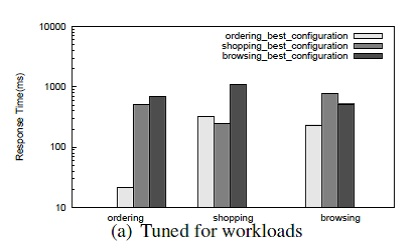
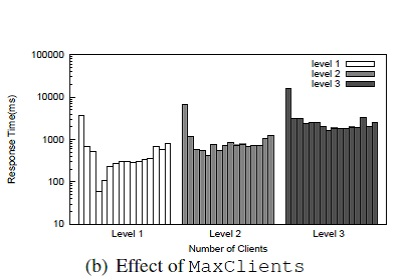
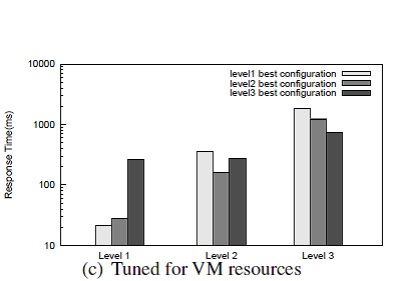
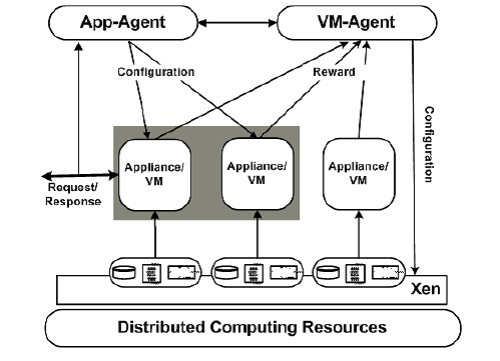
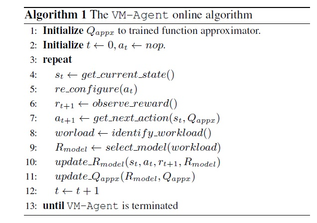
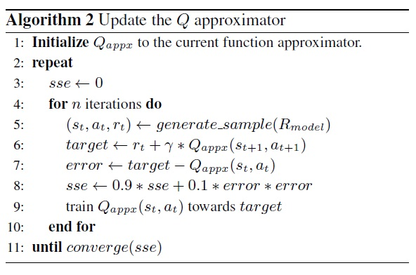
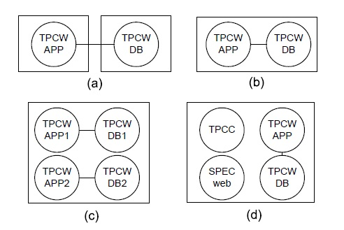
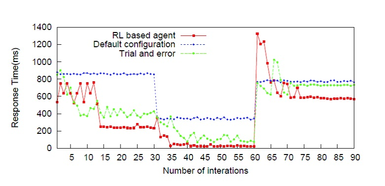

**Title: URL: A Unified Reinforcement Learning Approach for Autonomic Cloud
Management**

**Link:**
<https://www.sciencedirect.com/science/article/abs/pii/S0743731511001924>

**Publication: Journal of Parallel and Distributed Computing Volume 72, Issue 2,
February 2012, Pages 95-105**

**Author: Cheng-Zhong Xu, Xiangping Bu (Wayne State University), Jia Rao
(University of Colorado Colorado Springs)**

-   Research Background

    -   Unified reinforcement learning approach (URL) to automate the
        configuration process of virtualization

-   Problem to Solve

    -   Virtualization management over XEN and similar hypervisor technologies
        is lacking multi-dimensional approach and flexibility

    -   CPU memory and runtime can suffer if one VM is consuming too much or the
        configuration is not optimal specially if configuration is done in
        dynamic approach

-   Key Design and Algorithm Proposed

    -   Challenges are:

        -   Match Configuration to Changing Workload

            -   Example is MaxClinet in apache which sets the maximum number of
                requests to be served simultaneously

        -   Match Configuration to Virtual Machine Dynamics

            -   web system hosted on VMs, its throughput is capped by the VMs
                configurations

            

            

            

        -   Interference of VMs and Heterogeneous Appliances

            -   Server virtualization allows multiple VMs to share computing
                resources in the same pool

            -   Xen virtualization relies on a VM monitor (VMM) to manage the
                underlying computing resources

            -   In Xen dom0 is privileged VM which manages other guest domains
                (or VMs) and executes resource allocation policies

        -   URL Framework for Autoconfiguration

            

            

            -   State action pair s as a state and a as an action

            -   The objective of finding an optimal policy is to choose the
                action that maximizes the Q-value function in each state

            

            

            -   RL algorithms for Autoconfiguration

                -   Autoconfiguration of Virtual Machines

                -   VM state si as (vcpu; time;mem). For example, state (2, 256,
                    512MB) represents a VM configured with 512MB memory, 256
                    scheduling credit, and 2 virtual CPUs. Because the total
                    amount of computing resources available to the group of VMs
                    is limited, the parameter settings in different VMs have
                    constraints

            -   Model-based Reinforcement Learning

                -   VM-Agent

                    -   updates the estimation of each Q(s; a) value directly
                        from the recently collected immediate reward

                    

            -   Autoconfiguration for Virtual Appliances

                

-   Major Contribution

    -   Overall approach seems to be a good method to update the configuration
        of VMs

    -   Different setups has been tested

    

-   Major limitation

    -   Only works with one centralized virtualization

    -   Effectiveness can be based on known previous jobs and can be worst
        compare to default

        

-   Something you don’t understand

    -   Reward update was done in simpler way so based on different dimension
        approach this method may cause an overhead

-   Your view on the research domain/topic/approach/data/solution (positive or
    negative)

    -   Overall process was in the same solution that every other paper are
        focusing on however the lack of basic configuration for individual jobs
        can be an issue
