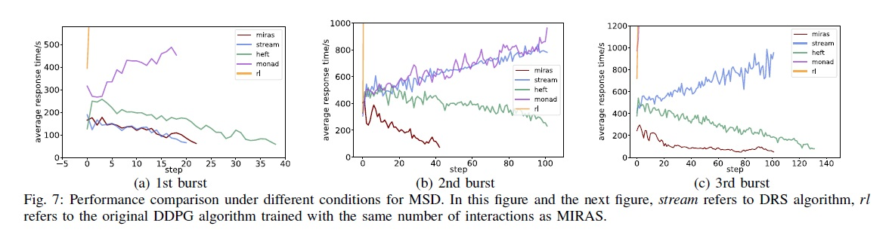

**Title: MIRAS: Model-based Reinforcement Learning for Microservice Resource
Allocation over Scientific Workflows**

**Link:** <https://ieeexplore.ieee.org/abstract/document/8885267>

**Publication: 2019 IEEE 39th International Conference on Distributed Computing
Systems (ICDCS)**

**The conference was held during July 7th to 10th 2019, in Dallas, Texas, USA.
The conference provides a platform for researchers, scientists and engineers in
various domains, in fields such as academics, industry and government, to
present their current findings in the emerging areas of distributed computing
and topics was Cloud Computing and Data Centers Distributed Big Data Systems and
Analytics Distributed Operating Systems and Middleware Distributed Algorithms
and Theory Distributed Fault Tolerance and Dependability Distributed Green
Computing and Energy Management Internet of Things and Cyber-Physical Systems
Mobile and Wireless Network Computing Edge Computing Security, Privacy, and
Trust in Distributed Systems Social Networks and Crowdsourcing Block Chain**

**Author: Zhe Yang, Phuong Nguyen, Haiming Jin, Klara Nahrstedt University of
Illinois at Urbana-Champaign Shanghai Jiao Tong University**

Research Background

-   Microservice, an architectural design that decomposes applications into
    loosely coupled services, is adopted in modern software design, including
    cloud-based scientific workflow processing. The microservice design makes
    scientific workflow systems more modular, more flexible, and easier to
    develop. However, cloud deployment of microservice workflow execution
    systems doesn't come for free, and proper resource management decisions must
    be made in order to achieve certain performance objective (e.g., response
    time) within constraint operation cost.

-   Problem to Solve

    -   adaptive resource allocation approach for microservice workflow system
        based on recent advances in reinforcement learning. Authors approach:
        (1) assumes little prior knowledge of the microservice workflow system
        and does not require any elaborately designed model or crafted
        representative simulator of the underlying system, and (2) avoids high
        sample complexity which is a common drawback of model-free reinforcement
        learning when applied to real-world scenarios

-   Key Design and Algorithm Proposed

    -   Microservice-Based Workflow Management

        

    -   Task dependency service based

        -   Upon receiving response from TDS, given a request of workflow type
            1, for example, the task invoker sends the request (step 2) to task
            A’s request queue (i.e., the first task of workflow type 1) so that
            it can be processed by one of A’s consumers (step 3). Besides being
            a subscriber to its task request queue, each task consumer also acts
            as a publisher for other types of tasks following the workflow’s
            task dependency graph

        

    -   Resource Models

    -   Challenges of Resource Adaptation

        -   Workflow requests arrive online, with variant number of requests in
            different time windows

        -   Resource adaptation decisions have cascading effects on
            microservices.

        -   Cloud services are still costly when scaling up, so the resources
            users have access to are often constraint

    -   Resource adaptation framework for microservice infrastructure

        

    -   Model-based reinforcement learning approach

        -   State, action, reward

        

        -   The fewer WIP of microservices, the shorter processing delays
            microservices will have and the shorter processing delays the system
            can support for different workflows. We define reward to be negative
            of the aggregated WIP across microservices observed at the end of
            each time window:

            

    -   Performance Model Generation

        -   Model learning

        -   Model Reinforcement

        -   Policy learning

        -   Iterative Model-based Reinforcement Learning

-   Major Contribution

    -   Implementation was done over Google cloud and Kubernetes

    

    

-   Major limitation

    -   Compared with limited scale

    -   Needs to implemented over other cloud systems

        

-   Something you don’t understand

    -   Optimizing the tasks instead of entire workflow could cause starvation
        or other scheduling problem how to ensure that system works with those
        problem

-   Your view on the research domain/topic/approach/data/solution (positive or
    negative)

>   Couple of method was useful to try in our work and the overall approach was
>   clear and understandable
