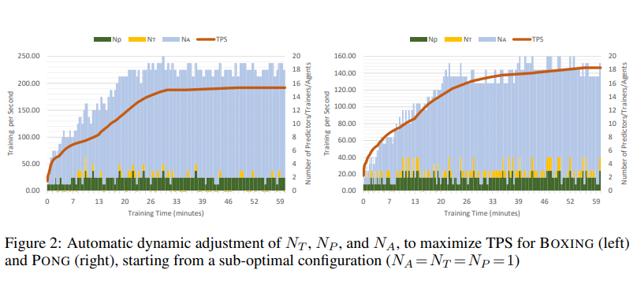
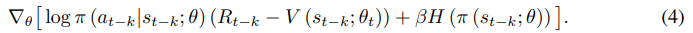
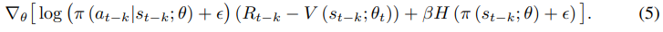
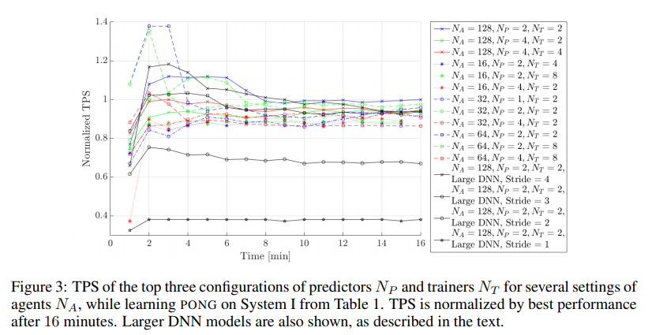
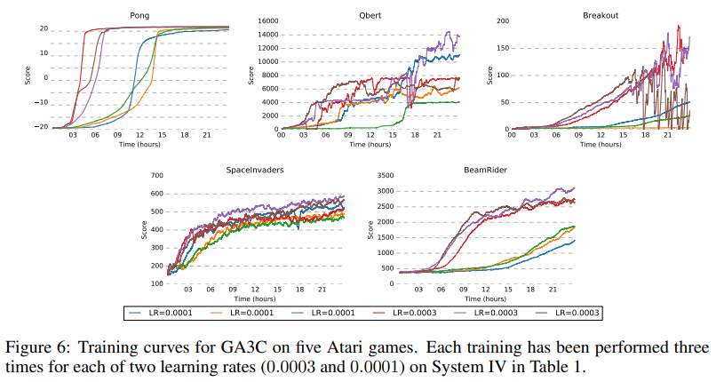
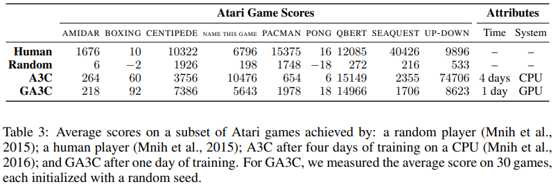

**Title: Reinforcement Learning through Asynchronous Advantage Actor-Critic on a
GPU**

**Link:**
<https://research.nvidia.com/publication/reinforcement-learning-through-asynchronous-advantage-actor-critic-gpu>

**Publication: 5th International Conference on Learning Representations**

**The performance of machine learning methods is heavily dependent on the choice
of data representation (or features) on which they are applied. The rapidly
developing field of representation learning is concerned with questions
surrounding how we can best learn meaningful and useful representations of data.
We take a broad view of the field and include topics such as deep learning and
feature learning, metric learning, compositional modeling, structured
prediction, reinforcement learning, and issues regarding large-scale learning
and non-convex optimization. The range of domains to which these techniques
apply is also very broad, from vision to speech recognition, text understanding,
gaming, music, etc.**

**Authors: Iuri Frosio, Stephen Tyree, Jason Clemons, Jan Kautz, Mohammad
Babaeizadeh (University of Illinois at Urbana-Champaign)**

Research Background

-   Introduce a hybrid CPU/GPU version of the Asynchronous Advantage ActorCritic
    (A3C) algorithm, currently the state-of-the-art method in reinforcement
    learning for various gaming tasks.

-   Problem to Solve

    -   propose GA3C, an alternative architecture of A3C, with emphasize on an
        efficient GPU utilization to increase the number of training data
        generated and processed per second.

-   Key Design and Algorithm Proposed

    -   Unlike the original, each agent does not have its own copy of the model.
        Instead it queues policy requests in a Prediction Queue before each
        action, and periodically submits a batch of input/reward experiences to
        a Training Queue;

        -   Trainings Per Second (TPS)

>   which is the rate at which we remove batches from the training queue It
>   corresponds to the rate of model updates and it is approximately
>   proportional to the overall learning speed, given a fixed learning rate and
>   training batch size

-   Predictions Per Second (PPS)

>   the rate of issuing prediction queries from prediction queue, which maps to
>   the combined rate of gameplay among all agents

    -   DYNAMIC ADJUSTMENT OF TRADE-OFFS

    -   The setting of NP , NT and NA that maximizes the TPS depends on many
        aspects such as the computational load of the simulation environment,
        the size of the DNN, and the available hardware. the number of agents NA
        should at least match the available CPU cores, with two predictors and
        two trainers NP = NT = 2

    -   They propose an annealing process to configure the system dynamically.
        Every minute, we randomly change NP , NT , or NA by ±1, monitoring
        alterations in TPS to accept or reject the new setting. the optimal
        configuration is then automatically identified in a reasonable time, for
        different environments or systems.

    -   POLICY LAG IN GA3C

    

    -   This delay can lead to instabilities for two reasons. The first one is
        the possible generation of very large values in log π (at−k\|st−k; θt).
        In fact, π (at−k\|st−k; θt−k) is generally large, since it is the
        probability of sampled action at−k, but over the course of lag k new
        parameters θt can make π (at−k\|st−k; θt) very small. In the worst case,
        the updated probability is zero, generating infinite values in the log
        and causing optimization to fail. To avoid this, we add a small term
        epsilon \> 0:

    

    -   Beyond fixing the error in the case π = 0, this fix also improves the
        stability of the algorithm and removes the necessity of gradient
        clipping.

-   Major Contribution

    -   Stability over A3C algorithm with hybrid version of DNN network

    -   Maximizing training speed

-   Major limitation

    -   Applicable for large DNN networks

    -   Needs High performance GPU for speed up

    

-   Something you don’t understand

    -   How did they solve the trap looping issue?

    

-   Your view on the research domain/topic/approach/data/solution (positive or
    negative)

    -   Using epsilon with equation is useful because at beginning of training
        we can have reward of zero as mentioned in this paper
