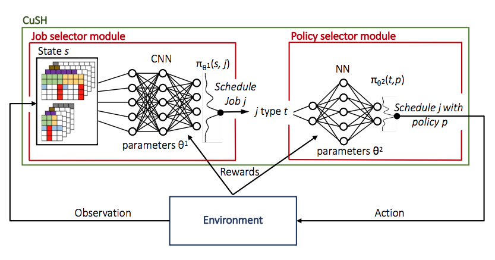
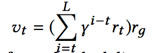
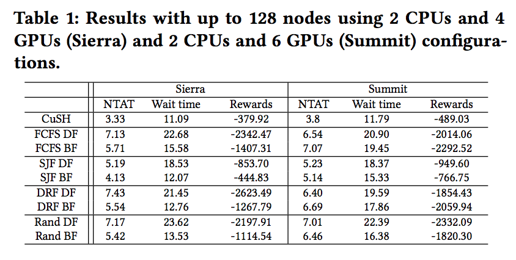
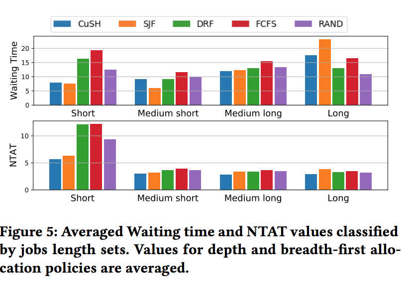
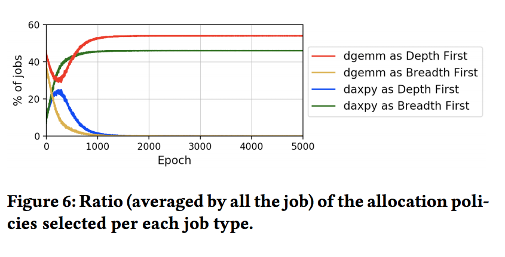
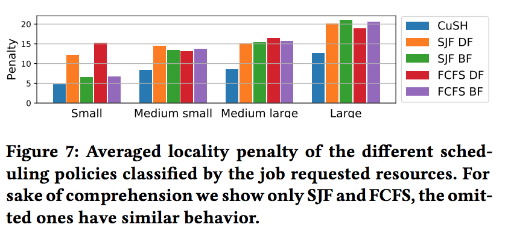
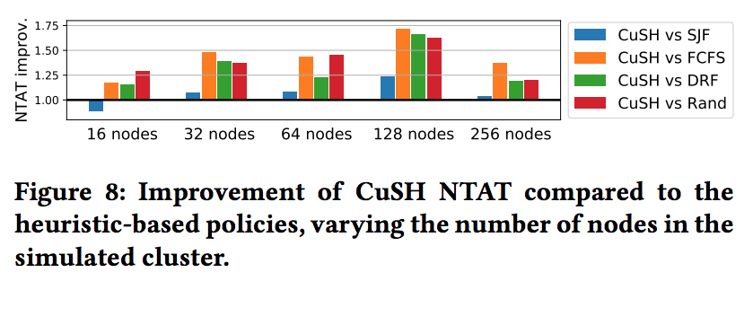

### Title: [ CuSH: Cognitive ScHeduler for Heterogeneous High Performance Computing System](https://www.cse.msu.edu/~zhaoxi35/DRL4KDD/10.pdf)
### Publication: Workshop on Deep Reinforcement Learning for Knowledge Discovery, Alaska USA 2019

	> 	Conference Introduction: 
	> 	While supervised and unsupervised learning have been extensively
	> 	used for knowledge discovery for decades and have achieved immense success, much less attention has
	> 	been paid to reinforcement learning in knowledge discovery until the recent emergence of deep
	> 	reinforcement learning (DRL). By integrating deep learning into reinforcement learning, DRL is not
	> 	only capable of continuing sensing and learning to act, but also capturing complex patterns with the
	> 	power of deep learning. Recent years have witnessed the enormous success of DRL for numerous domains
	> 	such as the game of Go, video games, and robotics, leading up to increasing advances of DRL for
	> 	knowledge discovery. For instance, RL-based recommender systems have been developed to produce
	> 	recommendations that maximize user utility (reward) in the long run for interactive systems;
	> 	RL-based traffic signal systems have been designed to control traffic lights in real time to enhance
	> 	traffic efficiency for urban computing. Similar excitement has been generated in other areas of
	> 	knowledge discovery, such as graph optimization, interactive dialogue systems, and big data systems.
	> 	While these successes show the promise of DRL, applying learning from game-based DRL to knowledge
	> 	discovery is fraught with unique challenges, including, but not limited to, extreme data sparsity,
	> 	power-law distributed samples, and large state and action spaces. Therefore, it is timely and
	> 	necessary to provide a venue, which can bring together academia researchers and industry
	> 	practitioners (1) to discuss the principles, limitations and applications of DRL for knowledge
	> 	discovery; and (2) to foster research on innovative algorithms, novel techniques, and new
	> 	applications of DRL to knowledge discovery. 

### Author：Giacomo Domeniconi, Eun Kyung Lee and Alessandro Morari, IBM T.J. Watson Research Center Yorktown Heights, NY, USA

# Paper Review 
## •	Research Background 
Traditionally, high performance computing systems included sophisticated and highly-configurable job management software to optimize the system depending on the hardware characteristics and the workload. however more complex system required more advanced scheduler, the authors approad is to use DNN and RL to manage the resources of HPC. 
using similar approach as DeepRM they represent jobs and state in 2 demintional matrix and use it in RL to create CNN network. this approach is to use the resources data as artificial image to use RL algorithm.

> Figure 3: Example of environment (state) representation. This representation shows a cluster of 2 nodes (each one
> with 2 CPUs and 4 GPUs) and a queue (job slots) of 3 waiting
> jobs.

	The y-axis of the image represents the time dimension (each row is one of the T timesteps) and the x-axis represents the hardware resources. A set of matrices represents the current resource allocation in the cluster, and another set of matrices represents the resource requirements by waiting jobs in the queue. The modeling of different resources is entrusted to separate matrices, having a matrix for each resource r (for instances CPU, GPU, memory, etc.) with the number of columns S^r as the availability of resources in the cluster. At each timestep, assuming M waiting jobs, the scheduling task is the definition of a subset of the jobs to be scheduled.

##	• Problem to Solve 
i) introduces the notion of resource locality, and this affects the actual computation time of the jobs; ii) distinguishes between jobs of various workload types, increasing the algorithm effectiveness and iii) introduces the notion of waiting time in the state representation.

## Proposed Solution
Model the RL environment as a cluster with N separate nodes, each having R resource types, a fixed number of available resource
per node S^r (all nodes have the same size), and a queue of Q jobs waiting to be scheduled. Users submit jobs to the waiting queue.
Then, the scheduler selects one or more of them to run at a given timestep.

> As it happens in traditional HPC job schedulers, such as
> IBM© Spectrum LSF2, Slurm3, or FLUX4, job submission includes information regarding the required hardware resources (e.g., CPUs,
> GPUs, Memory, etc.) and the expected execution time (an upper bound of the actual completion time).
> The simulator returns the execution time of the jobs and takes into account how resource locality affects it. For
> instance, a job using 4 GPUs on the same node has higher locality than one using a single GPU in 4 different nodes. We collect from
> an actual HPC system the execution time of different workloads using different policies

## •	Key Design and Algorithm Proposed

Each job j is characterized by a profile containing a resources requirements vector rj = (rj,1, ...,rj,R), the duration time tj and the workload
type wj.

The CuSH agent is responsible for two tasks: select the next job in the queue and allocate the resources.

>Figure 1: CuSH hierarchical agents trained via RL process.

## •	Major Contribution 

> Figure 2: Execution time of compute intensive workload
> (dgemm, left) and network intensive workload (daxpy, right)
> with different resource allocation methods.

Figure 2 shows the execution time for the dgemm and daxpy
workloads with the two allocation policies. Each node used in
the experiments contains 4 GPUs. In Figure 2 (a) the execution
time of dgemm workload decreases (performance increases) when
using the depth-first allocation policy and with a higher number
of nodes. This is because using more resources reduces time to
execute the same size of dgemm matrix and using localized GPUs
(depth-first) always helps reduce time to copy matrices. Figure 2 (b)
shows that the execution time of daxpy workload tends to decrease
(performance increases) with the breadth-first policy, in this case a
lower number of nodes leads to better performance. This is because
daxpy is a network intensive workload and using a higher number of
GPUs within a node (depth-first) adversely impact the performance
creating a network bottleneck. Figure 2 (a) and (b) also show the
performance impact when increasing the workload parallelism.

	With dynamic scheduling, when the user does not explicitly specify the type of the job, the job is
	classified as “unknown”. Then, after few executions, the job type can be automatically classified with a machine learning model
#### Job selector module (JSM)
	Stj = tj + pj 

The total requested resources by a job cannot exceed the total cluster resources: 4 CPUs and 8 GPUs in this example. Each job in the queue is represented as the number of requested resources for a certain time duration tj.

>For instance, the violet job in the first slot requires 2 CPUs and 6 GPUs for 4t.
To reduce the size of the state representation, the maximum length of a job is reduced to T . Each job that is longer than T is
represented by an equivalent job of length T . However, when it is scheduled it will run for its original duration

However, DeepRM forces the job length to be contained in the state y-axis. This may cause an
explosion of states when a longer (or fine-grained) job comes into the queue, leading to difficulties in training the scheduling agent. In
addition, we keep the observable queue size Q fixed.

New jobs are temporally stored in a backlog queue and moved to the observed queue once free slots are available in the observed queue. This shrewdness permits us to keep the state space of a reasonable size, even for a large environment.

	The cluster nodes are concatenated together along the x-axis, forming R matrices of N ·Sr ×T size (in the example 4×5 for CPU and 8×5 for GPU), which is the same size of the representation of the waiting jobs.
	
DeepRM uses binary matrices to input whether a resource is in use/requested (1) or not (0), but the authors additionally code the current waiting time (instead of the 1s) for the waiting jobs in the queue. Considering that the RL agent treats the states with Markov property, without this information the agent cannot know if a job is waiting for a long time or it has just arrived in the queue.

	The reward function uses a slightly different version of the common discounted future rewards [6]. In JSM, the return vt represents the combination of discounted future local rewardsrt and the global reward rд obtained at the end of the simulation, as in Eq. 1. This approach allows us to combine a local and immediate reward with a global one. The returns reflect how well the agent behaved in simulations.
	

	The local reward rt for each scheduling action is the sum of the ratio between waiting time and requested time duration of all the waiting job in the queue and in the backlog: rt = −SUM Q j=1 w tj lj − SUM j=1 w tj lj

to optimize global reward the authors decided to use averaged normalized turnaround time (NTAT), as we believe it is the most
suitable for the real scenarios. γ = 0.9 as the discount factor.
#### Policy selector module (PSM)

The PSM has the goal of selecting which policy use to allocate a job that has to be scheduled. We designed the input as the workload
type: daxpy or dgemm in the simulation. We fed this input to a shallow fully connected NN with a hidden layer of 10 neurons and
a ReLU activation, followed by a softmax that returns as output the probability distribution for the two possible allocation policies (i.e.
depth- or breadth-first). The module is trained with policy gradient. The return vt is only based on the local action at and its reward value rt. The return is the locality penalty (vt = rt = pj), that is calculated using the projected workloads data.

Training a reinforcement agent is a compute-intensive task. Several approaches have been proposed to parallelize the training
process, the authors adopted a P-learner K-step model averaging algorithm (KAVG) to explicitly manage the gradient staleness in
parallel implementations.

	With KAVG, P workers run concurrently and average their parameters every K epochs

#### CUSH PERFORMANCE EVALUATION

The environment simulator simulates the behavior of an HPC cluster with N = 128 nodes. It considers R = 2 resource types (CPUs
and GPUs) and it models two possible real-case configuration scenarios: i) S
CPU = 2 and S
GPU = 4 per node (similarly to the Sierra
supercomputer) which is the default setting for our experiments;
ii) S
CPU = 2 and S
GPU = 6 per node (similarly to the Summit
supercomputer).

#### considered two workload types: 
* compute intensive (dgemm) 
* network intensive (daxpy)

		The JSM sees a temporal horizon of T = 5. The size of the waiting jobs queue visible to the JSM is Q = 5

In the default configuration, each training epoch is composed of
10 job sets. Each jobset contains 20 jobs of a maximum time length
of 20t.

* leaning rate α^1 = 1e^−4 for job selector agent
* learning rate α^2 = 1e^−3 for the policy selector
* training for 5000 epochs
* Models are trained using a KAVG distributed training on 12 GPUs with K = 5.

#### Performance Metrics and Scheduling Policies

To evaluate CusH we compare its performance against four traditional heuristic-based policies.

* First Come First Serve (FCFS) policy, which treats the waiting jobs as a FIFO queue, scheduling the first arrived one. In case of two jobs arrived at the same time, the shortest one is selected.
* Shortest Job First (SJF) policy, which schedules the shortest job in the queue. In case of multiple jobs with the same length, the first arrived one in the queue is scheduled.
* Dominant Resource Fairness (DRF) policy, which selects the job with the smaller request of the dominant resource. The dominant resource of a job is the one with the higher ratio between request and environment availability.
* Random (Rand) policy, which schedules a random job in the queue.

All the policies are implemented with both a depth-first and a
breadth-first version.
	

Figure 4 shows the averaged TAT, NTAT, Waiting Time and Rewards
for CuSH training over the 5000 epochs in a Sierra environment
(128 nodes with 2CPUs and 4GPUs each). The figures show the
evolution of CuSH effectiveness (black lines) compared to the four
policies in both depth-first (DF) and breadth-first (BF) allocation
policies. It is clear that all the evaluation metrics are related to
each other in the training phase. The training process ends with a
best NTAT value of 3.33, that corresponds to an improvement of
19% with respect to the 4.13 of the best heuristic (SJF BF), and an
improvement of 42% with respect to the FCFS policy, that is the
one used for a default scheduling policy for IBM© Spectrum LSF.
This results are also shown in Table 1.

### •	Major limitation 

training time requires GPU power and time

### •	Something you don’t understand 

they didn't compare their system result with DeepRM which they said originaly it was their motivation 

### •	Your view on the research domain/topic/approach/data/solution (positive or negative)

it was a well explained and good for implementation however, considering they had access to IBM resources using simulator is kind of diaspointment.