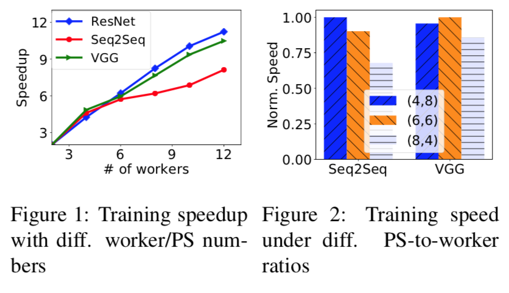
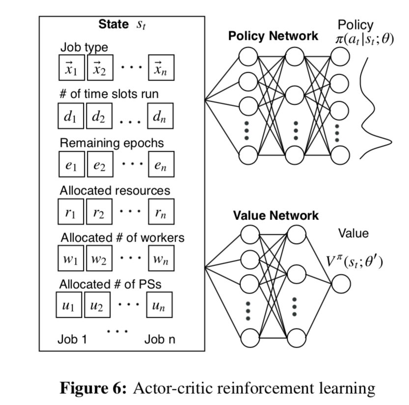
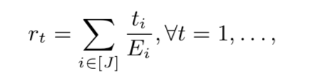
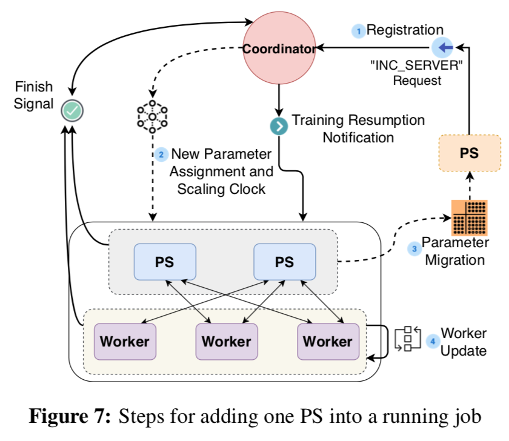
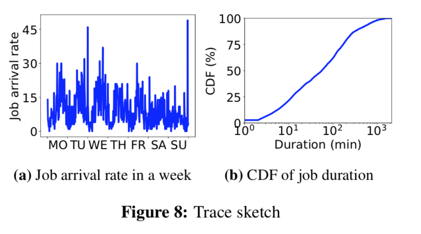
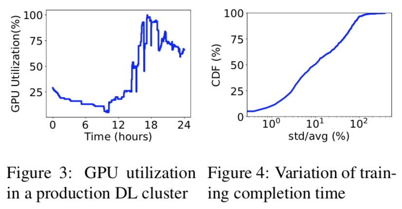
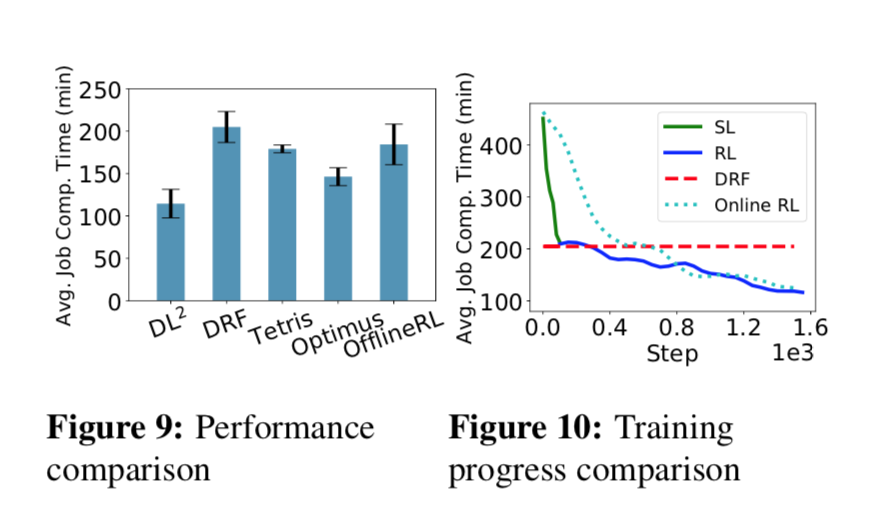
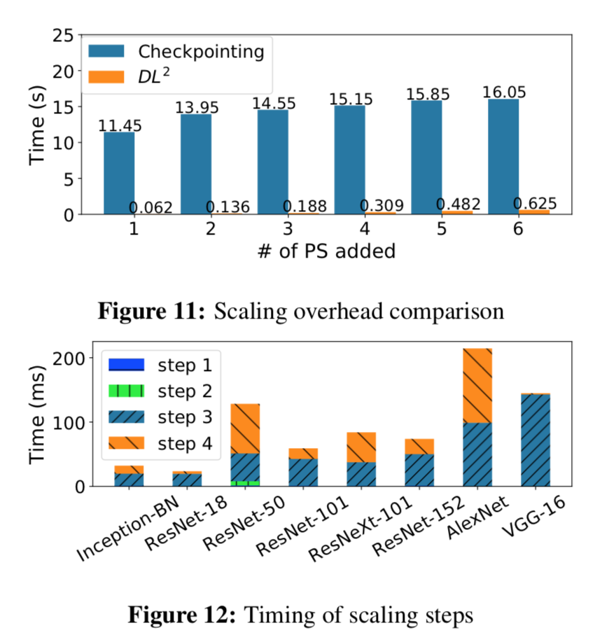
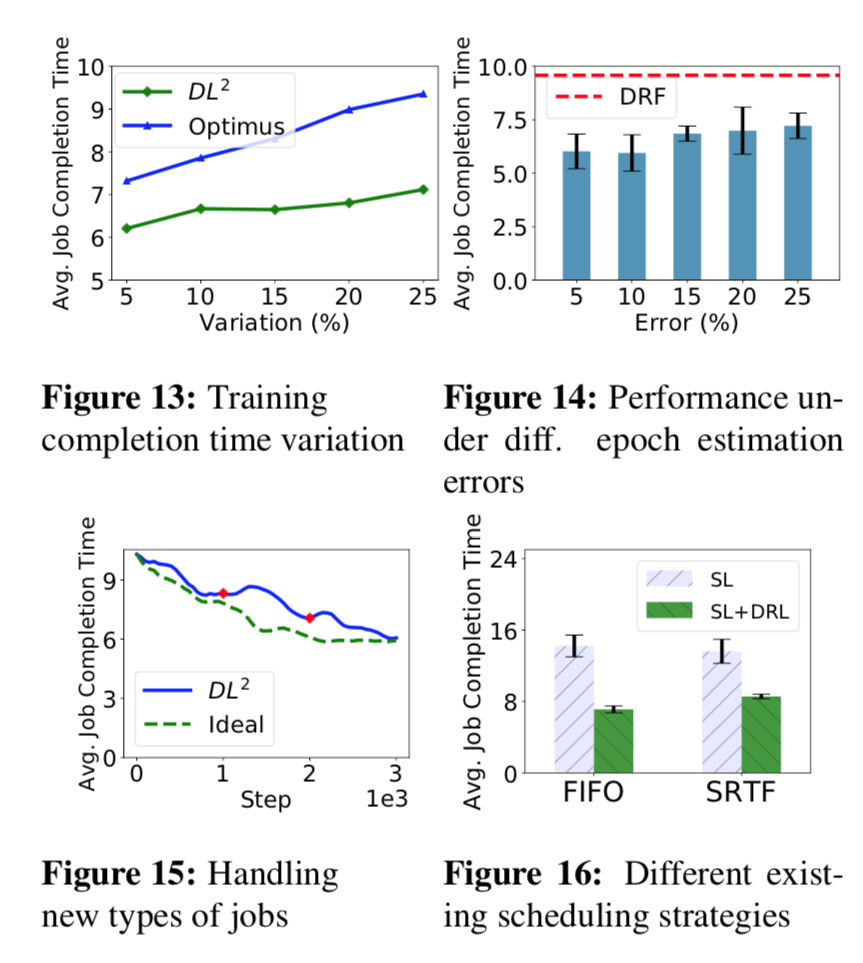
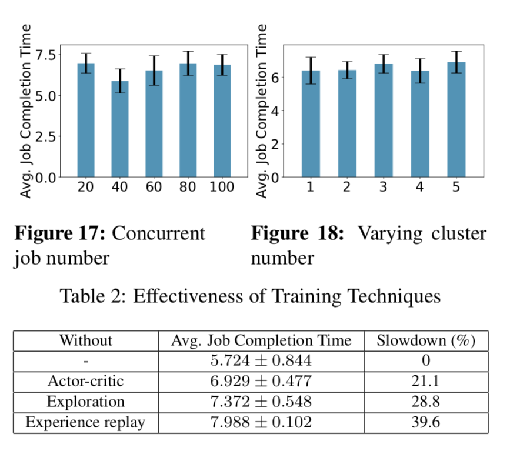

### Title: [ DL2: A Deep Learning-driven Scheduler for Deep Learning Clusters](https://arxiv.org/abs/1909.06040)
### Publication: [arXiv:1909.06040](https://arxiv.org/abs/1909.06040) [cs.LG] 2019

### Author：Yanghua Peng, Yixin Bao, Yangrui Chen, Chuan Wu, The University of Hong Kong; Chen Meng, Wei Lin, Alibaba Inc.

## Paper Review 

### •	Research Background 

#### The Parameter Server Framework

Focused on the parameter server (PS) architecture, which is widely adopted in distributed ML learning frameworks for parallel training, such as in MXNet, TensorFlow, PaddlePaddle and Angel.

The data partition at each worker is divided into mini-batches; each worker processes a mini-batch locally and computes model parameter changes, typically expressed as gradients. The gradients are pushed to PSs which main- tain global model parameters.

The user specifies how many PSs and workers she/he wishes to use and the amount of resources (e.g., GPU, CPU) each PS/worker needs, and then submits the job to the scheduler (e.g., Borg, YARN, Mesos).

###	• Problem to Solve 
Existing cluster schedulers either are agnostic to ML workload characteristics, or use scheduling heuristics based on operators’ understanding of particular ML framework and workload, which are less efficient or not general enough.
on top of previous problem, efficient resource scheduling is crucial in operating a shared DL cluster with multiple training jobs, for best utilization of expensive resources and expedited training completion.

#### Proposed Solution

DL2 is a DL-driven scheduler for DL clusters, targeting global training job expedition by dynamically resizing resources allocated to jobs. DL2 advocates a joint supervised learning and reinforcement learning approach: a neural network is warmed up via offline supervised learn- ing based on job traces produced by the existing cluster scheduler;

Recent studies have proposed white-box heuristics for resource allocation in ML clusters, Typically they tackle the problem in two steps: set up analytical models for DL/ML workloads, and propose scheduling heuristics accordingly for online re- source allocation and adjustment. Designing heuristics re- quires a deep understanding of ML frameworks and work- loads, and the analytical model is tightly coupled with the ML framework implementation (e.g., a new feature or op- timization in evolving ML frameworks may invalidate the analytical model). we pursue a DL cluster scheduler that does not depend on expert heuristics and explicit mod- eling, resorting to a black-box end-to-end approach enabled by modern learning techniques.

### •	Key Design and Algorithm Proposed

##### Current DRL Algorithms  
Existing DRL applications in resource scheduling scenarios use simulators to generate training data for offline training, and apply trained models for resource scheduling in a live system.
##### Authors Approach 
Bootstrap the model using minimal offline supervised learning with any available historical job traces and decisions of any existing scheduling strategy employed in the cluster.then use online training with feedback from ongoing decision making in a live system, with carefully designed techniques to guide model convergence to high-quality decisions, which min- imize average job completion time in the cluster.

##### In General Authors' Proposal: 
* In contrast to previous DL cluster scheduling approaches that require analytical performance model and job profiling, DL2 adopts a more generic design, i.e., using DRL to schedule DL workloads. Instead of simulation-driven RL model training, we adopt online training with real feedback from online resource allocation 

* To avoid poor decisions at the beginning of online RL, we apply past decisions made by an existing scheduler in the DL cluster in a preparatory offline super- vised learning stage.

With fixing the total number of PSs and workers to be 12 and measure the training speed of two models under different combinations of PS/worker numbers (i.e., 4:8, 6:6, 8:4) the authors tried to avoid communication overhead between nodes in training phase. 

#### DL Cluster
For synchronous training, to guarantee the same training result (model) while varying the number of workers, we adjust the mini-batch size of each worker, so that the total batch size in a job, as specified by the user, still remains unchanged. For asynchronous training, the mini-batch size of each worker remains the same while the number of workers varies (as the global batch size equals each worker’s batch size).

#### DL2 Scheduler
Their DL-based scheduler, DL2, adopts joint offline and on-line learning of a policy neural network (NN) for making resource allocation decisions to concurrent jobs in the cluster.

* Offline supervised learning. For warm-up, we use super- vised learning to train the policy NN, to initialize a policy whose performance is as good as the existing scheduler in the DL cluster. A small set of historical job runtime traces collected from the cluster are used for supervised learning, to allow the NN to produce similar decisions as made by the existing scheduler.
* Online reinforcement learning. Online RL works in a time-slotted fashion; each time slot is a scheduling interval, e.g., 1 hour.

#### Policy Neural Network
#####  State. The input state to the policy NN is a matrix s = (x, d⃗, ⃗e, ⃗r, w⃗ , ⃗u), including the following:

* x, a J × L matrix representing the DL models trained in the jobs, where J is an upper bound of the maximal number of concurrent jobs in a time slot that we are scheduling, and L is the maximal number of training job types in the cluster at all times. Each vector ⃗xi in x, ∀i = 1,...,J, is a one-hot encoding of job i’s type. For example, if there are 3 job types in total and 3 concurrent jobs in each type respectively, then x = {[100]; [010]; [001]}.
* d ⃗, a J-dimensional vector encoding the number of time slots that each job has run in the cluster, for all jobs. For example, di is the number of time slots that job i has run.
*  ⃗e, a J-dimensional vector encoding the remaining number of epochs to train for each job. ei is the difference between user-specified total training epoch number for job i and the number of epochs trained till current time slot.
* r, a J-dimensional vector representing the amount of dominant resource already allocated to each job in the current time slot. For example, ri is the amount of dominant resource (the type of resource the job occupies most as compared to the overall capacity of the resource in the cluster) allocated to job i by resource allocation decisions already made through inferences in this time slot.
* w ⃗ and ⃗u, each of them is a J-dimensional vector where the i-th item is the number of workers (PSs) allocated to job i in the current time slot.

##### Action. The NN produces a policy π : π(a | s; θ⃗) → [0,1], which is a probability distribution over the action space. a represents an action, and θ⃗ is the current set of parameters in the NN.

limited action space to increase the training speed: 

* (i) (i, 0), meaning allocating one worker to job i, 
* (ii) (i, 1), allocating one PS to job i, 
* (iii) (i, 2), allocating one worker and one PS to job i, 
* (iv) a void action which indi- cates stopping allocating resources in the current time slot

#### NN architecture. 
The input state matrix s is connected to a fully connected layer with the ReLU function for activation. The number of neurons in this layer is proportional to the size of the state matrix. Output from this layer is aggregated in a hidden fully connected layer, which is then connected to the final output layer. The final output layer uses the softmax function as the activation func- tion. The NN architecture is designed based on empirical training trials.

#### Reward

The per-timeslot reward is the sum of normalized number of epochs that the concurrent jobs have trained in this time slot, where the number of epochs trained in job i (ti) is normalized over the overall number of epochs to train for the job (Ei)

The rationale is that the more epochs a job runs in a time slot, the fewer time slots it takes to complete, and hence maximizing cumulative reward amounts to minimizing average job completion time.

##### Job-aware exploration.
To obtain a good policy through RL, we need to ensure that the action space is adequately explored (i.e., actions leading to good rewards can be sufficiently produced); as otherwise, the RL may well converge to poor local optimal policy. We first adopt a commonly used entropy exploration method, by adding an entropy regularization term β ▽θ⃗ H(π(· | s; θ⃗)) in gradient calculation to update the policy network. In this way, parameters of the policy network, θ⃗, is updated towards the direction of higher entropy (implying exploring more of the action space).

The set of poor input states includes three cases: 

* (i) there exists one job to be scheduled which has been allocated with multiple workers but no PS; 
* (ii) there ex- ists one job which has been allocated multiple PSs but no workers; 
* (iii) there exists one job whose allocated num- bers of workers (w) and PSs (u) differ too much, i.e., w/u > threshold or u/w > threshold (the threshold is 10 in our experiments). 

Manually specified action upon each of these input states is: 

* (i) allocate one PS to that job; 
* (ii) allocate one more worker to the job; 
* (iii) allo- cate one more PS or one more worker to that job, to make its worker/PS numbers more even.

#### Scaling Steps. 
By adding a coordinator module into the MXNet framework, which works with DL2 scheduler to handle joining of new workers or PSs and termination of existing ones. design used by the case of adding a new PS into an existing job. The steps are shown in Fig. 7.

### •	Major Contribution 

The ultimate goal of DL2 is to find the best resource allo- cation policy in a live DL cluster and minimize the aver- age job completion time among all concurrent jobs.

Testbed. Our testbed includes 13 GPU/CPU servers connected by a Dell Networking Z9100-ON 100GbE switch. Each server has one Intel E5-1660 v4 CPU, two GTX 1080Ti GPUs, 48GB RAM, one MCX413A-GCAT 50GbE NIC, one 480GB SSD, and one 4TB HDD. Each server runs Ubuntu 14.04 LTS and Docker 17.09-ce

Trace. We use patterns from a 75-day real-world job trace collected from a large production DL cluster with a few thousands of GPUs and thousands of jobs, to drive our testbed experiments and simulation studies. Fig. 8 (a) shows the job arrival rate (number of jobs arrived per time slot, i.e., 20 minutes) during a typical week. Fig. 8 (b) shows the distribution of job duration: over a half of jobs run for more than an hour and some for days; the average job duration is 147 minutes.

### •	Major limitation 

##### Difficulty in setting the right worker/PS numbers
 
the ratio between PS and workers are hard to determine and the authors choose 12 based on observation but no proof on the actual best number. 
 
##### Static resource allocation
expensive GPU on the same machine are usually being left alone because of the cost in their proposal they said we can use idle GPUs as dynamic resources or any other available resources. 

##### White-box heuristics
* First, in order to derive an accurate performance model, the modeling process is coupled tightly with ML framework implementation, and remodeling is often needed when the framework changes (e.g., adding new features or adopting optimization). For example, Optimus models computation and communication as two separate procedures during one training step; its model needs to be rebuilt when new features are in- corporated into ML frameworks, e.g., overlapping backward computation with communication, gradient compression.
* Second, explicit performance models are built without considering interference in multi-tenant GPU clusters. For example, SLAQ and Optimus assume no network congestion on PSs, and OASiS and Optimus assume that the available bandwidth is a constant.
* 

### •	Something you don’t understand 

### •	Your view on the research domain/topic/approach/data/solution (positive or negative)

#### we can develop this work to extend as they mentioned in paper itself:

More scheduling features. Besides minimizing average job completion time, DL2 can implement other scheduling features by adjusting the learning objective. For ex- ample, we can incorporate resource fairness by adding a quantified fairness term in the reward function. All-reduce architecture. All-reduce architecture [61], where workers train model replicas and exchange updated model parameters directly with each other, is supported in Caffe2 [5], CNTK [6], etc. Though this paper focuses on the PS architecture, DL2 can readily handle jobs using allreduce architecture with minor modification of input state and action space of its NN, e.g., removing the elements related to PSs.
Job placement. While we use the default placement policy in this work, the placement of workers and PSs can potentially be decided by RL too. Using one NN to pro- duce both resource allocation and placement decisions is challenging, mainly because of the significantly larger ac- tion space. RL using a hierarchical NN model [44] might be useful in making resource allocation and placement decisions in a hierarchical fashion.
Practical deployment. In practical deployment, the following two issues may need to be considered: (1) adversarial attacks that fool a neural network with malicious input; (2) neural network monitoring that detects exceptional scheduling. These are interesting directions to explore, with progress in security research and more in-depth understanding of neural networks.