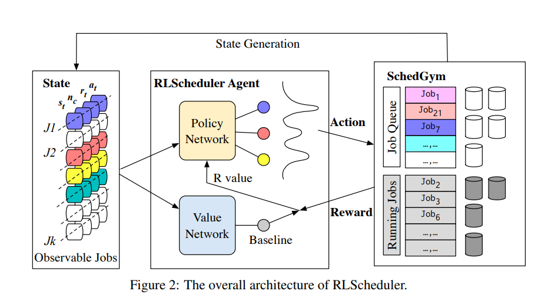
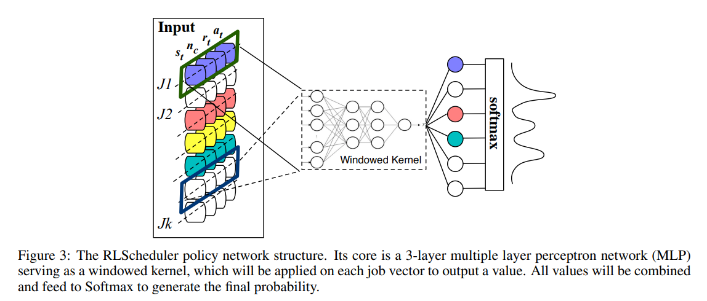
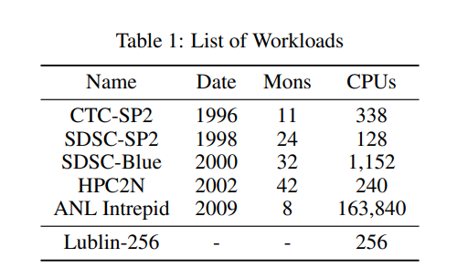
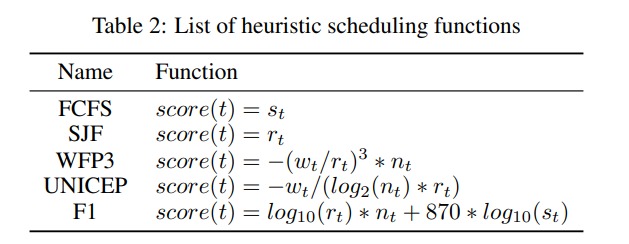
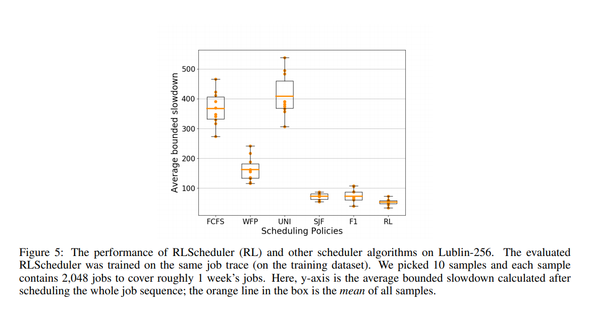
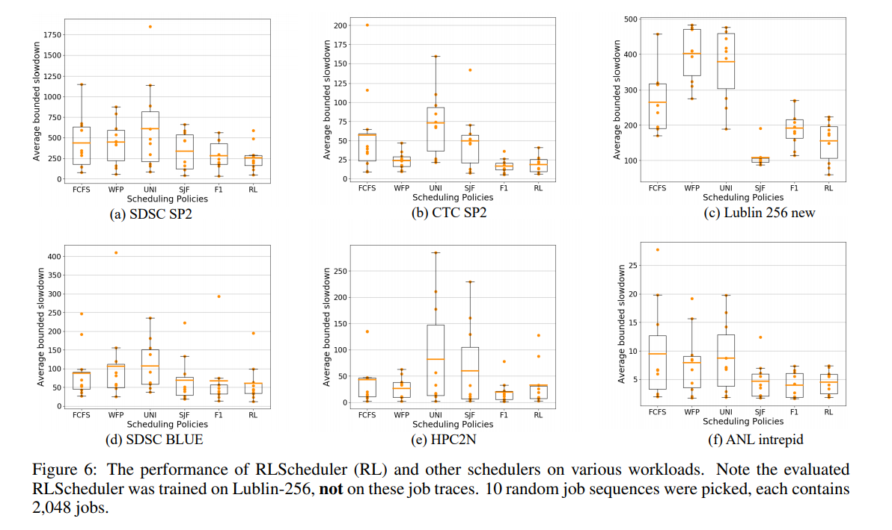
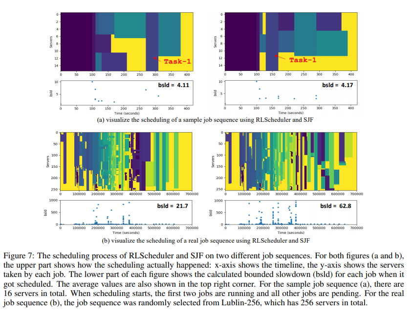
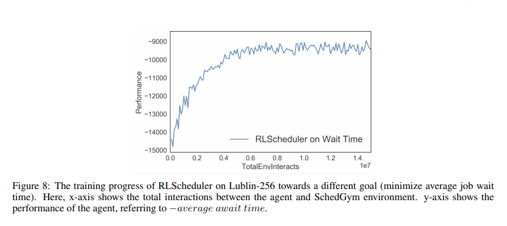

### Title: [ RLScheduler: Learn to Schedule HPC Batch Jobs Using Deep Reinforcement Learning](https://arxiv.org/abs/1910.08925)
### Publication: [arXiv:1910.08925](https://arxiv.org/abs/1910.08925)  [cs.DC] 2019

### Author：Di Zhang, Dong Dai, Computer Science Department, University of North Carolina at Charlotte;  Youbiao He, Forrest Sheng Bao Computer Science Department, Iowa State University

## Paper Review 

### •	Research Background 

#### The Parameter Server Framework

Show that deep reinforcement learning agents can effectively learn how to schedule HPC batch jobs. The learned rules are generally applicable to different workloads and systems.
propose a set of design choices and optimizations in RLScheduler to stabilize and accelerate deep reinforcement learning for HPC job scheduling tasks.
show that RLScheduler is capable of adapting to different optimization goals, making it attractive for autonomous HPC job management.

###	• Problem to Solve 
Use RL to schedule resources over HPC -->
HPC batch job has multiple features can be seen in job script, such as user id, group id, requested nodes, maximal execution time, and the submitted queue, etc. Although all these job features can be potentially useful for making scheduling
decisions, in this study, we focus on a subset of them (as listed below), mainly for making fair comparisons with other
schedulers. 
* The id of a job id.
* The submission time of a job st.
* The requested computing nodes of a job nc.
* The requested execution time of a job rt.

#### Proposed Solution

 the state includes the current waiting jobs, running jobs, and the availability of resources; the action
is the job scheduled; the transition is the changes on the waiting jobs, running jobs, and resources availability once
a job was scheduled to run; and the reward is the measurement of optimization goal we cared about. In this sense,
scheduling HPC batch jobs turns into solving a finite MDP problem, and can be solved using reinforcement learning
methods.

### •	Key Design and Algorithm Proposed

#####  RLScheduler Agent  
The core of deep reinforcement learning is its agent (i.e., the deep neural networks), which is trained to accurately
model the system state and generate the correct actions. In RLScheduler, we introduce two designs to facilitate the
training: 1) inspired by the priority function concept, we design a kernel-based network structure optimized for job
scheduling; 2) leveraging the actor-critic model, we use a value network to reduce the high variance of HPC job
scheduling task

##### Policy network structure 
RLScheduler agent contains two neural networks: policy network and value network. The policy network represents
the policy (πθ). It takes current pending jobs as input and outputs the probability of scheduling each of them. We will
discuss the role of value network in the next subsection.

Fig. 3 shows the detailed structure of policy network. This kernel-based structure is inspired by the fact that most
existing heuristic job schedulers are essentially using a priority function which takes job features as inputs and outputs
its priority value to schedule. So, we set a window, which will take one job each time as the input to the same kernel
network. The kernel is simply a multiple layer perceptron (MLP) network. It outputs a single value for each job.
The outputs of different jobs are combined and feed to softmax for normalizing and the final probability. This network
is similar to the kernel used in convolutional neural networks (CNN), which significantly reduces parameters size
and increases training efficiency. 

##### Value network and variance reduction 
Author used value network in RLScheduler to further stabilize and accelerate the training. It outputs a single adjustment value for each state to eliminate the effects of variant job sequences.

##### SchedGym Environment

The reinforcement learning agent needs an enormous number of interactions to learn, which is not practical in a
running HPC system. A more realistic way to train DRL-based job scheduler from a cold start is to collect the job
workloads from the real system periodically and train the agent in a simulated environment using the collected realworld workloads. To do this, we implemented a simulated HPC environment, named SchedGym based on the OpenAI
Gym toolkit to facilitate the training. OpenAI Gym is a generic platform for developing and comparing reinforcement
learning algorithms

#### RLScheduler Observable State
State is the input of deep reinforcement learning agent. In RLScheduler, we incorporate two important info in the state
to help make the scheduling decisions: 1) pending jobs info, and 2) available resource info.
More specifically, RLScheduler arranges state as a vector of job vectors, as the colored rectangles shown in Fig. 3.
Each vector represents a job, consist of three attributes from the job itself (job arriving time st, request computation
resources of the job nc, requested runtime of the job rt) and one attribute from the cluster (available resources availt)

So, to make it more straightforward for the agent, the authors
actually use at = availt − nc to abstract the availability

####  Observation Padding and Cut-off
In the real system, the number of pending jobs changes, hence the size of the vector should also change accordingly.
However, deep neural network only takes a fixed-size vector as inputs. To solve this, we set the observable system
state to be a fixed size (MAX_OBSV_SIZE). If there are fewer pending jobs, we pad the vector with all 0s job vector;
if there are more pending jobs, we cut-off them selectively. The number of observable jobs is a configurable training
parameter. We set it to 128 in RLScheduler by default, as many HPC job management systems, such as Slurm, also
limit the number of pending jobs to the same order of magnitude

####  Suggested Candidates
        Since only a fixed number of jobs are observable to the agent, we certainly hope the best scheduling candidates are
        among them. So, when cut-off the pending jobs, we leverage heuristic scheduling algorithms to generate suggested
        candidates and avoid cutting them. Specifically, we leverage SJF and FCFS to sort the pending jobs separately and
        choose jobs from both the sorted list in a round-robin way. These suggested candidates should have better chances to
        be the final scheduled job. In our evaluations, we will show how suggestions can help the performance.

#####   Sorting

        Once determining the observable jobs, the next thing is to place them into the vector, which will be represented to the
        agent. Since our policy network is order insensitive, in RLScheduler, we will just randomly shuffle all the jobs before
        feeding them to the RLScheduler agent. Our results in the evaluation section also show sorting order does not affect
        the training of our RLScheduler.

### •	Major Contribution 

The ultimate goal of DL2 is to find the best resource allo- cation policy in a live DL cluster and minimize the aver- age job completion time among all concurrent jobs.

Testbed. Our testbed includes 13 GPU/CPU servers connected by a Dell Networking Z9100-ON 100GbE switch. Each server has one Intel E5-1660 v4 CPU, two GTX 1080Ti GPUs, 48GB RAM, one MCX413A-GCAT 50GbE NIC, one 480GB SSD, and one 4TB HDD. Each server runs Ubuntu 14.04 LTS and Docker 17.09-ce

Trace. We use patterns from a 75-day real-world job trace collected from a large production DL cluster with a few thousands of GPUs and thousands of jobs, to drive our testbed experiments and simulation studies. Fig. 8 (a) shows the job arrival rate (number of jobs arrived per time slot, i.e., 20 minutes) during a typical week. Fig. 8 (b) shows the distribution of job duration: over a half of jobs run for more than an hour and some for days; the average job duration is 147 minutes.

### Results 

### •	Major limitation 

use of 0s jobs as a fixer in training and later removing it can cause another overhead for learinign algorithm

### •	Something you don’t understand 

### •	Your view on the research domain/topic/approach/data/solution (positive or negative)

use of RL in scheduling HPC was good however using A3C can be more helpful and not using a simulator to train the system might be an advantage that we can take. 