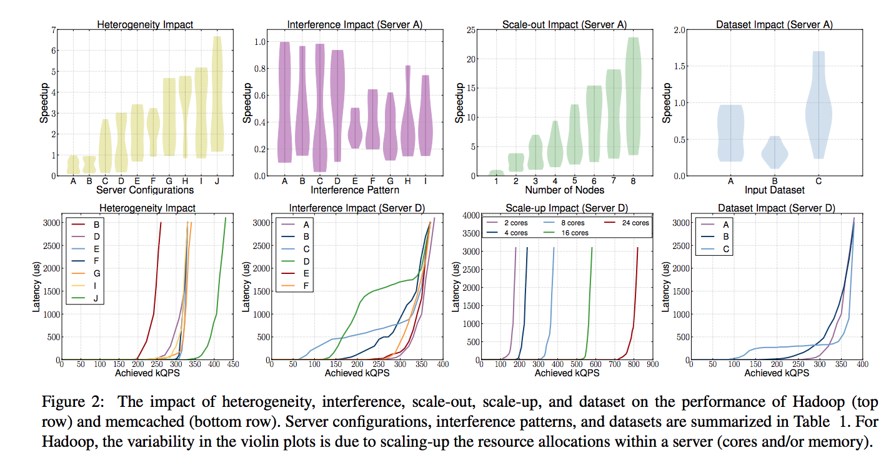
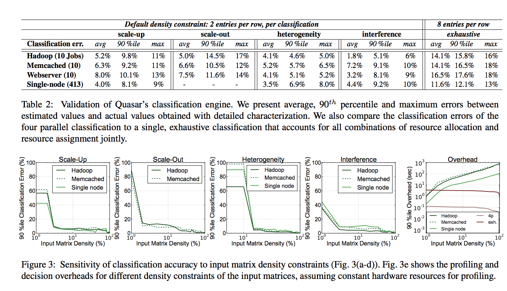
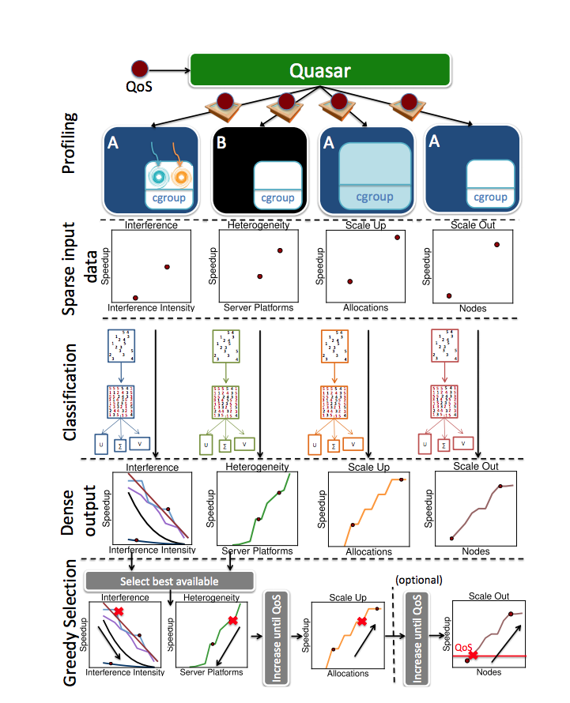
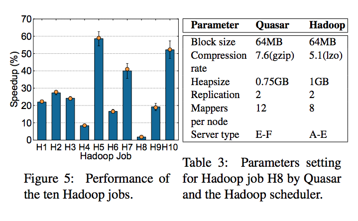
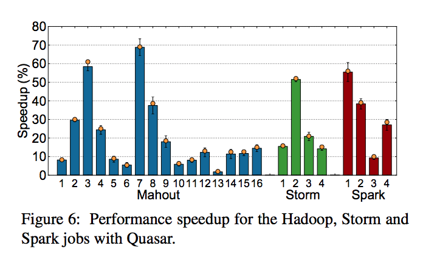
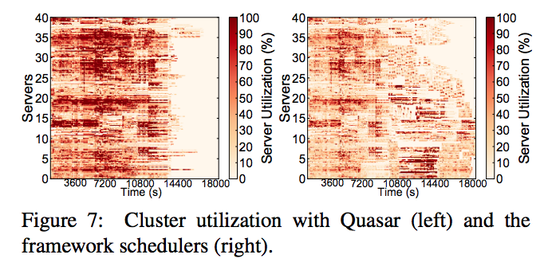

### Title: [ Quasar: Resource-Efficient and QoS-Aware Cluster Management](http://www.csl.cornell.edu/~delimitrou/papers/2014.asplos.quasar.pdf)
### Publication: [19th International Conference on Architectural Support for Programming Languages and Operating Systems (ASPLOS)](https://dl.acm.org/conference/asplos) 10.1145/2541940.2541941 2014

ASPLOS is a multi-disciplinary conference for research that spans the boundaries of hardware, computer architecture, compilers, languages, operating systems, networking, and applications. ASPLOS provides a high quality forum for scientists and engineers to present their latest research findings in these rapidly changing fields. It has captured some of the major computer systems innovations of the past two decades (e.g., RISC and VLIW processors, small and large-scale multiprocessors, clusters and networks-of-workstations, optimizing compilers, RAID, and network-storage system designs). This conference occurs at a time when computer architecture is facing great challenges, due both to the end of single-processor performance scaling and to new demands imposed by mobile and gigascale computing. Multi-disciplinary research is increasingly important as boundaries between hardware/software and local/network computing blur, as the form and capabilities of computing devices beco.

### Author：Delimitrou, Christina and Kozyrakis, Christos Stanford University, USA

## Paper Review 

### •	Research Background 

#### Cloud management for resources and scability 
they focused on cluster management and used amazon EC2 and windows Azure and Google Computing engine to manage all available resources. 
 

###	• Problem to Solve 
switching between cloud platforms and detecting resources for scheduler could be a challenge and this paper is focused on solving it by cluster categorization. 

* Resource allocation
* Resource assignment
* Coordinated Cluster Management

### Proposed Solution

performance cetric optimization, using SVD and machine learning methods they proposed a method to solve the optimization problem by categorizing resources. 

 increase resource utilization in datacenters through better cluster management. The manager
is responsible for providing resources to various workloads
in a manner that achieves their performance goals, while
maximizing the utilization of available resources.

Quasar uses fast classification techniques to
quickly and accurately estimate the impact different resource
allocation and resource assignment decisions have on workload performance.

Quasar classifies for scale-up, scale-out, heterogeneity, and interference. The four classifications are done
independently and in parallel to reduce complexity and overheads.

* Scale-up classification
* Profiling collects performance measurements in the format of each application’s performance goal (e.g., expected completion time or QPS) and inserts them into a matrix A with workloads as rows and scale-up configurations as columns.
* Scale-out classification
* This type of classification is only applicable to workloads that can use multiple servers, such as distributed frameworks (e.g., Hadoop or Spark), stateless (e.g., webserving) or stateful (e.g., memcached or Cassandra) distributed services, and distributed computations (e.g., MPI jobs).
* Heterogeneity classification
* This classification requires one more profiling run on a different and randomly-chosen server type using the same workload parameters and for the same duration as a scale-up run.
* Interference classification
* This classification quantifies the sensitivity of the workload to interference caused and tolerated in various shared resources, including the CPU, cache hierarchy, memory capacity and bandwidth, and storage and network bandwidth.
* Multiple parallel versus single exhaustive classification
* 	Classification is decomposed to the four components previously described for both accuracy and efficiency reasons. The alternative design would consist of a single classification that examines all combinations of resource allocations and resource assignments at the same time.
*  

The steps for cluster management with Quasar.
Starting from the top, short runs using sandboxed workload copies produce the initial profiling signal that classification techniques expand to information about relationship
between performance and scale-up, scale-out, heterogeneity,
and interference. Finally, the greedy scheduler uses the classification output to find the number and type of resources
that maximize utilization and application performance.

### •	Key Design and Algorithm Proposed

resource partitioning used in this paper could be usfull thorugh our research but it does not have direct relation with our approach maybe for future use when we want to add other platform. 

### •	Major Contribution 

better resource management and overall better performance 

### •	Major limitation 
it needs previous knowledge over dataset

### •	Something you don’t understand 

### •	Your view on the research domain/topic/approach/data/solution (positive or negative)

not a bad approach but differ from our in terms of using the resources.

Practical deployment. In practical deployment, the following two issues may need to be considered: (1) adversarial attacks that fool a neural network with malicious input; (2) neural network monitoring that detects exceptional scheduling. These are interesting directions to explore, with progress in security research and more in-depth understanding of neural networks.