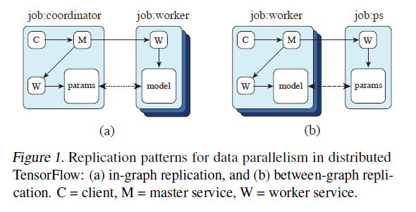
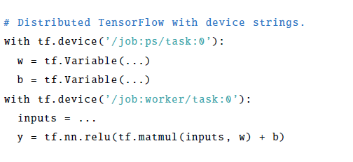
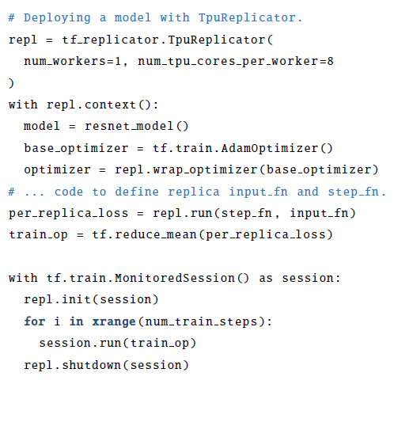
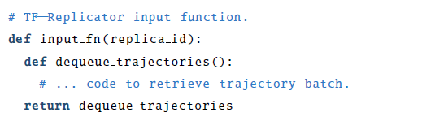
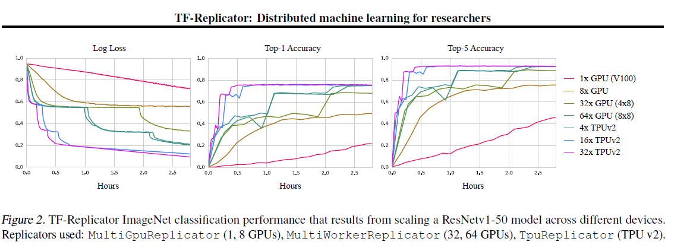
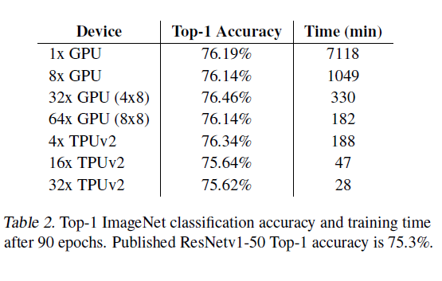
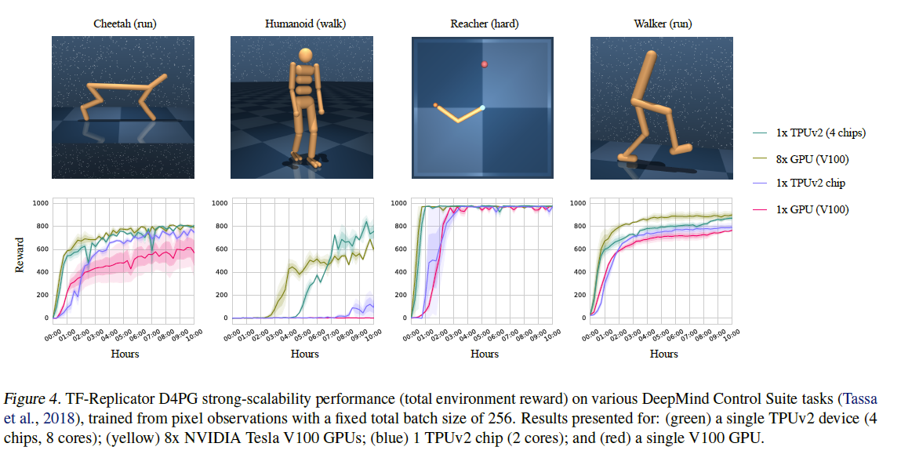

### Title: [ TF-REPLICATOR: DISTRIBUTED MACHINE LEARNING FOR RESEARCHERS](https://arxiv.org/abs/1902.00465)
### Publication: [arXiv:1902.00465](https://arxiv.org/abs/1902.00465)  [cs.LG] 2019

### Author：Peter Buchlovsky, David Budden, Dominik Grewe, Chris Jones, John Aslanides, Frederic Besse, Andy Brock, Aidan Clark, Sergio Gómez Colmenarejo, Aedan Pope, Fabio Viola, Dan Belov ; DeepMind, London, UK.

## Paper Review 

### •	Research Background 

#### TF-Replicator

TF-Replicator, designed and developed
in close collaboration with DeepMind researchers
across several machine learning disciplines.

###	• Problem to Solve 
framwork tried to solve the problem of scale horizontally
across massively distributed compute clusters to
conduct experiments in large magnitude. 

#### Proposed Solution

the provided an API to be between tensorflow and end user to provide more functionality and better optimization

### •	Key Design and Algorithm Proposed

##### Job cordinator 
##### Job worker 
##### Job PS (parameter Server)

For in-graph replication (Figure 1(a)), a single client binary
constructs one replica on each device (all contained
in a massive multi-device graph), each sharing a set of parameters
(resources) placed on the client’s own device.

For between-graph replication (Figure 1(b)), multiple machines
run a client binary, each creating a graph with a single
replica on a local device, alongside resources on a shared
device (i.e. the parameter server model).

#### Graph Replicas

Use the key
concept of a replica: a computation designed to be run
in parallel across many devices (e.g. one step of SGD),
with different input to each device, and some shared state
accessible to all replicas (e.g. model parameters). Many
machine learning techniques (e.g. Hogwild! (Recht et al.,
2011), Downpour SGD (Dean et al., 2012) and A3C (Mnih
et al., 2016)) can be seen as computations involving many
replicas with differing synchronicity of the shared parameters.

##### Limitations

handling queues in tensorflow could be a limitation however using windows sized like the other papers we can overcome this issue.

#### results
using their API for image process can endup with a faster execution 

### •	Major Contribution 

using A3C and RL they achieved a better performance by designing the system in steps so using same idea we can feed steps of workflow to our system and achieve the same result

### Results 

### •	Major limitation 

requires a large amount of gpu power

### •	Something you don’t understand 

### •	Your view on the research domain/topic/approach/data/solution (positive or negative)

the paper is good for detail implementation part of the system. 