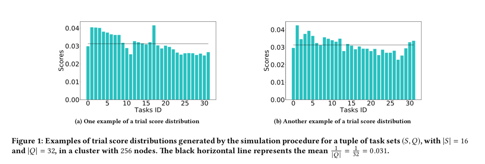
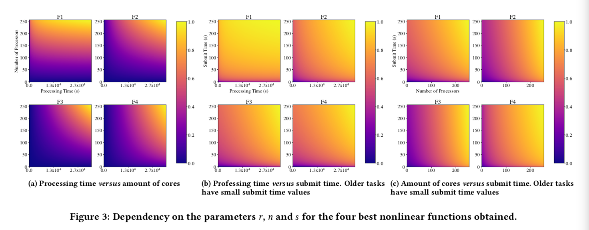
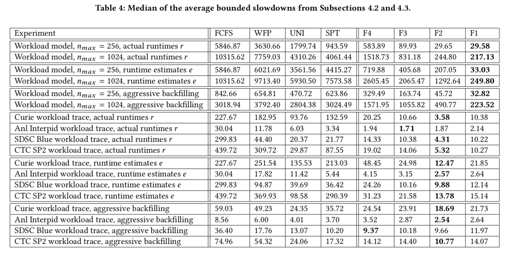
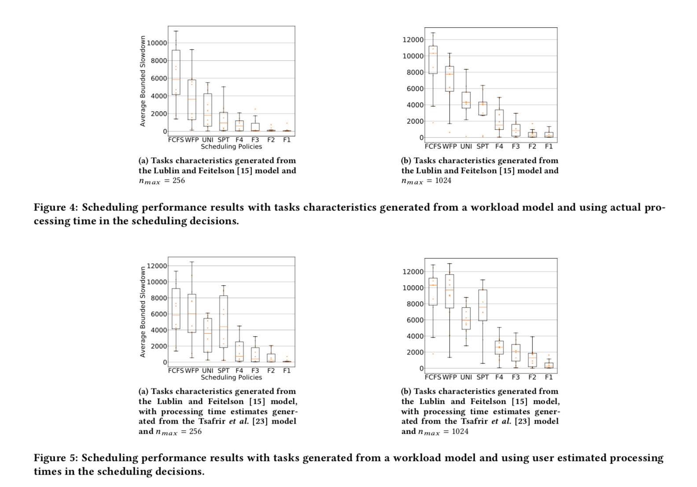
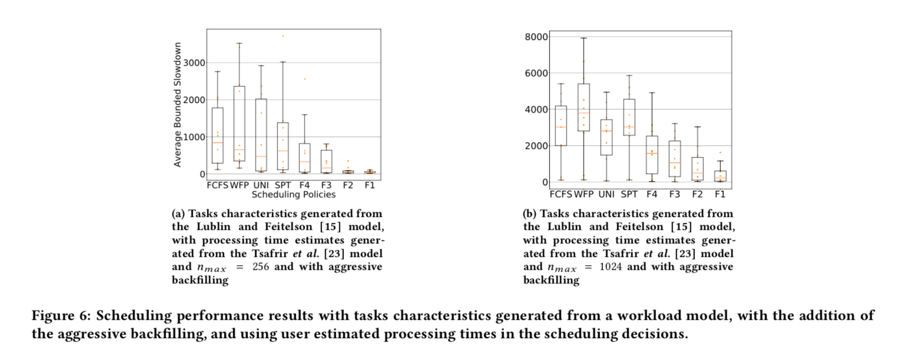
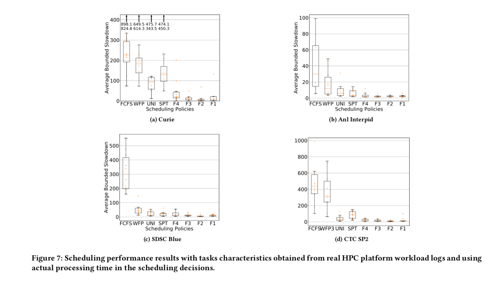
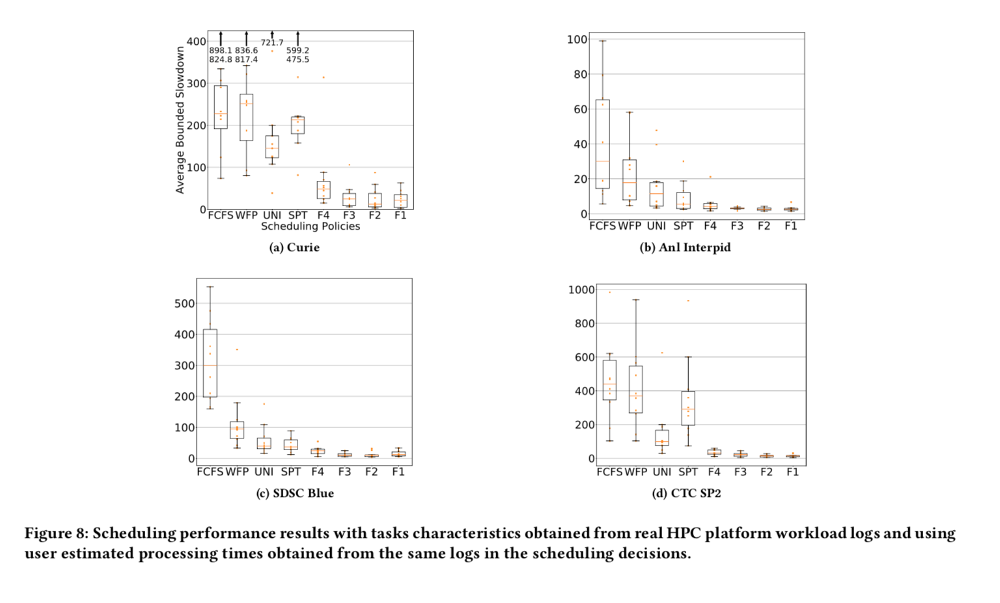
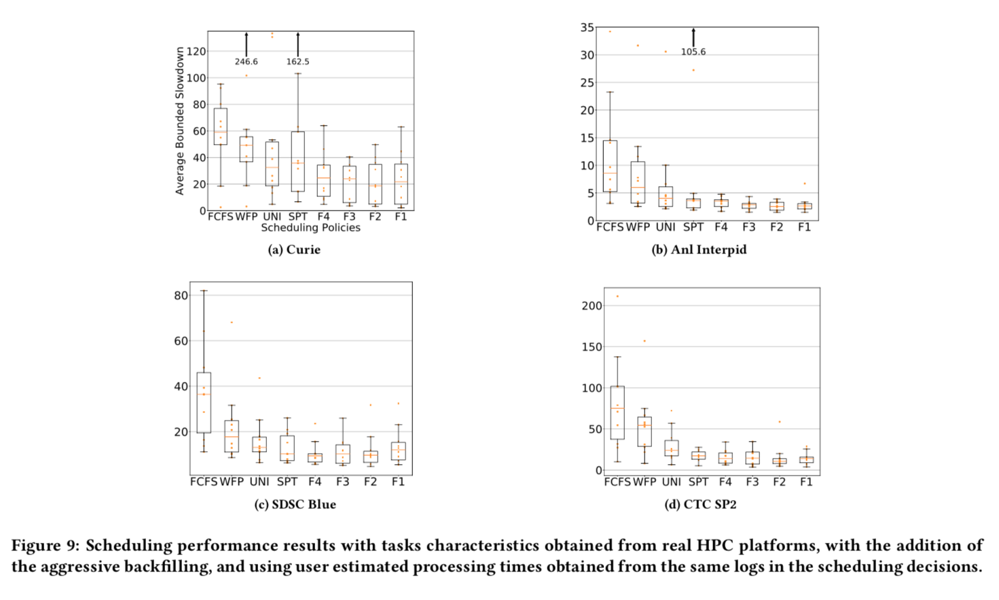

### Title: [ Obtaining Dynamic Scheduling Policies with Simulation and Machine Learning](https://dl.acm.org/doi/10.1145/3126908.3126955)
### Publication: [SC '17: Proceedings of the International Conference for High Performance Computing, Networking, Storage and AnalysisNovember 2017 Article No.: 32 Pages 1–13](https://doi.org/10.1145/3126908.3126955) 2017

### Author：Carastan-Santos, Danilo and de Camargo Universidade Federal do ABC, Santo André, Brazil; Raphael Y. 

## Paper Review 

### •	Research Background 

the authors tried to replace the machine learning technique with heuristic method for HPC they proposed a simple simulation to determine the likelihood of correct solution

###	• Problem to Solve 
online hpc scheduling based on heuristic data can be slow so replacing it with more advanced machine learning technique and using simulator to determine the optimal solution

### Proposed Solution

instead of backfilling and easy algorithm which is used in Slurm they proposed finding scheduling solution based on simulation

### •	Key Design and Algorithm Proposed

using simulator they calculated the mean and the score to determine the ratio of each task. task with lower ratio score have a more positive impact in average bounded slowdown when they are chosen to executed first. 

to choose a base function for nonlinear regression they take three simple functions into the consideration. 
error was calculated based on processing time r, number of used cores n , and araival time s difference with the calculated score. 

SimGrid was used to compare FCFS , SPT, etc. with machine learning method. 

#### scheduling performance 
* Using the actual processing time r in the scheduling deci- sions and the same number of cores nmax = 256 from the simulation scheme;
* Using the actual processing time r in the scheduling deci- sions, but increasing the number of cores to nmax = 1024;
* Usingtheprocessingtimeestimateeprovidedbytheuser, instead of the actual processing time r, to perform the
scheduling decisions;
* Usingtheprocessingtimeestimateeprovidedbytheuser,
but performing the scheduling using the aggressive back- filling algorithm;

#### performace evaluation 

### •	Major Contribution 

showing the difference between heuristic model and ML model by using simulator

### Results 

### •	Major limitation 
it not adoptable enough compared to RL method but its a good reference for background work on our paper

### •	Something you don’t understand 

### •	Your view on the research domain/topic/approach/data/solution (positive or negative)

good for background work and related part.