### Title: [ An Actor-Critic Algorithm for Sequence Prediction](https://arxiv.org/pdf/1607.07086)
### Publication: [	arXiv:1607.07086](https://arxiv.org/pdf/1607.07086)  [cs.LG] 2017

### Author：Dzmitry Bahdanau, Philemon Brakel, Kelvin Xu, Anirudh Goyal,  Aaron Courville, Yoshua Bengio University de Montreal ; Ryan Lowe, Joelle Pineau McGill University

## Paper Review 

### •	Research Background 

#### Recurrent neural networks
A recurrent neural network (RNN) produces a sequence of state
vectors (s1; : : : ; sT ) given a sequence of input vectors (e1; : : : ; eT ) by starting from an initial s0 state
and applying T times the transition function f: st = f(st􀀀1; et).

#### RNNs for sequence prediction 
To use RNNs for sequence prediction, they must be augmented
to generate Y conditioned on an input X. The simplest way to do this is to start with an initial
state s0 = s0(X)
Alternatively, one can encode X as a
variable-length sequence of vectors (h1; : : : ; hL) and condition the RNN on this sequence using an
attention mechanism.
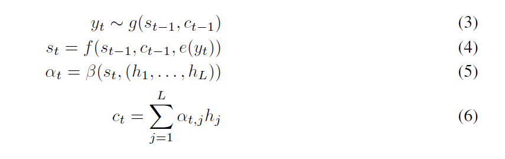

#### Value functions 
the authors viewed the conditioned RNN as a stochastic policy that generates actions and
receives the task score (e.g., BLEU score) as the return. We furthermore consider the case when
tPhe return R is partially received at the intermediate steps in the form of rewards rt: R(Y^ ; Y ) = T
t=1 rt(^yt; ^ Y1:::t􀀀1; Y ).

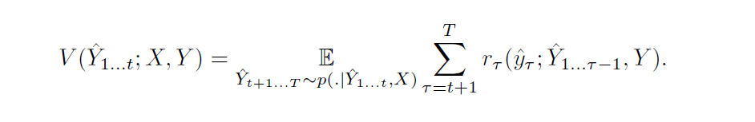
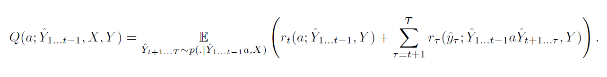

#### Algorithm 
they used critic to check for correct values in training session however to eliminate the loop and unwanted values they used restriction on expected values. 

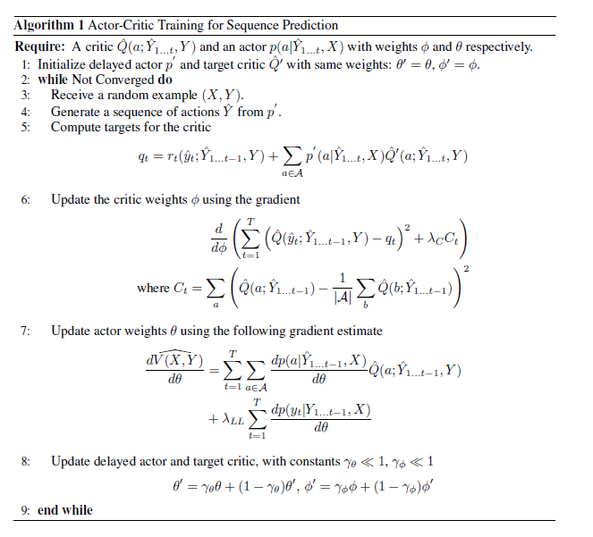

###	• Problem to Solve 
instead of log-likelihood training methods which are limited by the discrepancy between their training and testing modes, as models must generate tokens conditioned on their previous guesses rather than the ground-truth tokens the authors used training neural networks to generate sequences using actor-critic methods from reinforcement learning (RL). 
#### Proposed Solution

Let  be the parameters of the conditioned RNN, which we will also refer to as the actor. Our training
algorithm is based on the following way of rewriting the gradient of the expected return dV
d :

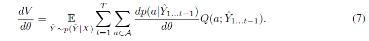

This equality is known in RL under the names policy gradient theorem and
stochastic actor-critic. Note that the authors used the probability rather than the log probability
in this formula (which is more typical in RL applications) as we are summing over actions rather
than taking an expectation. Intuitively, this equality corresponds to increasing the probability of
actions that give high values, and decreasing the probability of actions that give low values. Since
this gradient expression is an expectation, it is trivial to build an unbiased estimate for it:
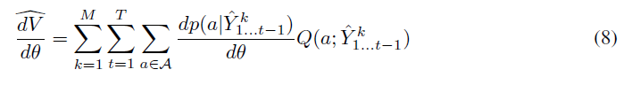
where ^ Y k are M random samples from p( ^ Y ). By replacing Q with a parameteric estimate ^Q
one can
obtain a biased estimate with relatively low variance. The parameteric estimate ^Q
is called the critic.
The above formula is similar in spirit to the REINFORCE learning rule that Ranzato et al. use
in the same context:
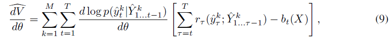
where the scalar bt(X) is called baseline or control variate. The difference is that in
REINFORCE the inner sum over all actions is replaced by its 1-sample estimate, namely
d log p(^ytj ^ Y1:::t􀀀1)
d Q(^yt; ^ Y1:::t􀀀1), where the log probability d log p(^ytj:::)
d = 1
p(^ytj:::)
dp(^ytj:::)
d is introduced
to correct for the sampling of ^ yt.

#### Temporal-difference learning 
A crucial component of our approach is policy evaluation, that
is the training of the critic to produce useful estimates of ^ Q. With a na¨ıve Monte-Carlo method,
one could use the future return
PT
=t r (^y ; ^ Y1:::􀀀1) as a target to ^ Q(^yt; ^ Y1:::t􀀀1), and use the
critic parameters  to minimize the square error between these two values.

#### Applying deep RL techniques 

It has been shown in the RL literature that if ^Q
is non-linear (like
in our case), the TD policy evaluation might diverge
#### Dealing with large action spaces 
One of the challenges of our work is that the action space is very
large (as is typically the case in NLP tasks with large vocabularies). This can be alleviated by putting
constraints on the critic values for actions that are rarely sampled.
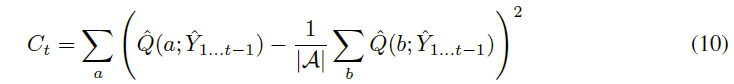
#### Reward shaping 
While the authors were ultimately interested in the maximization of the score of a complete
prediction, simply awarding this score at the last step provides a very sparse training signal for the
critic.For this reason they used potential-based reward shaping with potentials ( ^ Y1:::t) = R( ^ Y1:::t)
for incomplete sequences and ( ^ Y ) = 0 for complete ones

### •	Key Design and Algorithm Proposed

* using actor critic with log likelyhood
* restirction on range to limit the loops
* computing the value prediction based on expected values after initial training set

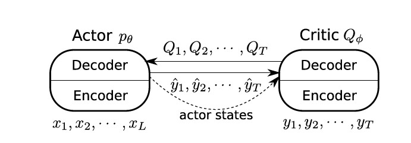

### •	Major Contribution 

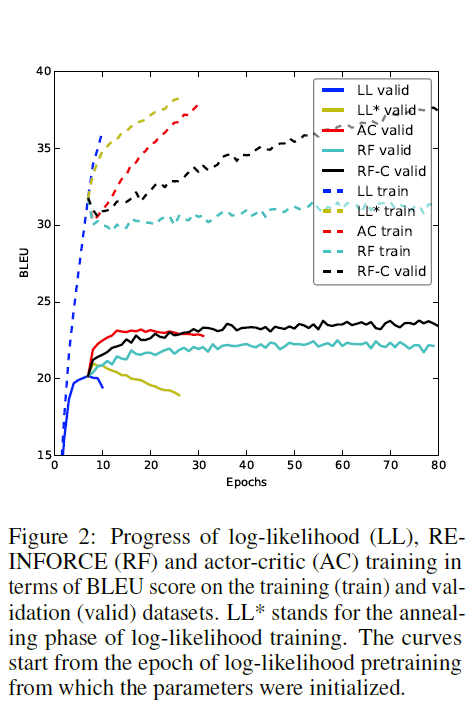

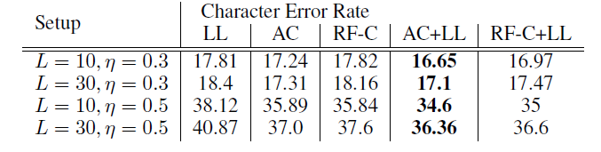
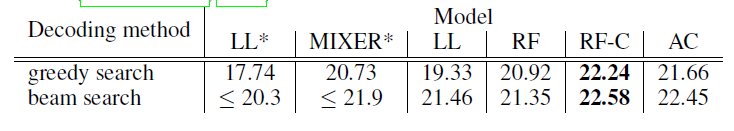
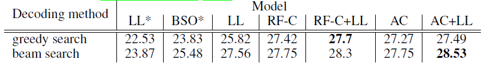
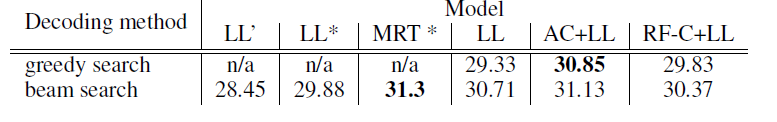

### •	Major limitation 

pre trained model used on system 
although the idea is good it need to run on noise less environment 

### •	Something you don’t understand 

how do they handle the even predicition distribution on critic model and the way they limit the range is unclear

### •	Your view on the research domain/topic/approach/data/solution (positive or negative)

method leads to significant improvements
over maximum likelihood training on both a synthetic task and a machine translation benchmark.
Compared to REINFORCE training on machine translation, actor-critic fits the training data much
faster, although in some of our experiments they were able to significantly reduce the gap in the training
speed and achieve a better test error using our critic network as the baseline for REINFORCE