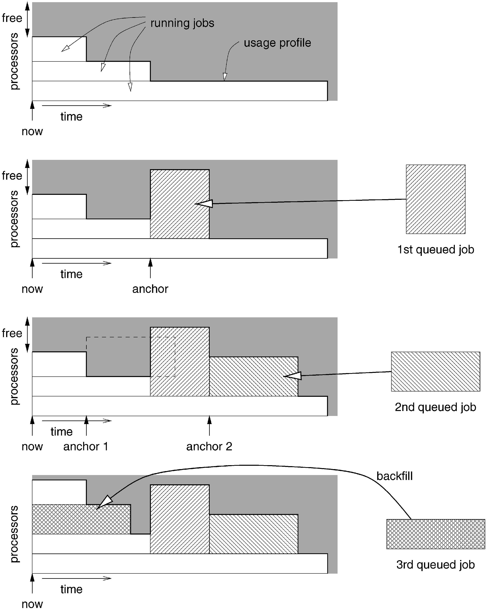

**Title: Utilization, Predictability, Workloads, and User Runtime Estimates in
Scheduling the IBM SP2 with Backfilling**

**Publication: IEEE Transactions on Parallel and Distributed Systems ( Volume:
12 , Issue: 6 , Jun 2001 )**

IEEE Transactions on Parallel and Distributed Systems (TPDS) is published
monthly. It publishes a range of papers, comments on previously published
papers, and survey articles that deal with the parallel and distributed systems
research areas of current importance to our readers.

**Author：Ahuva W. Mu'alem and Dror G. Feitelson**

Ahuva W. Mu'alem received the BSc degree in mathematics from the Technion and
the MSc degree in computer science from Hebrew University in 1999.

Dror G. Feitelson received the BSc degree in mathematics, physics, and computer
science in

1985, the MSc degree in computer science in 1987 (cum laude), and the PhD degree
in 1991, His recent focus is on the characterization and modeling of workloads
on production parallel machines with the goal of putting the evaluation of
parallel job scheduling policies on a more solid basis.

**Paper Review**

-   Research Background

    -   Scheduling scheme used on distributed systems by using FCFS algorithm
        suffers from fragmentation, where free processors cannot meet the
        requirements of the next job and therefore remain idle until additional
        ones become available.

    -   There are many methods to solve this problem one of them is non-FCFS
        approach which reorders the jobs in the queue.

-   Problem to Solve

    -   Use dynamic partitioning to schedule tasks to run on distributed system
        such that the utilization is maximum

-   Key Design and Algorithm Proposed

    -   Backfilling

        -   Conservative backfilling

>   Algorithm Conservative Backfill.

1.  Find anchor point:

    1.  Scan the profile and find the first point where enough processors are
        available to run this job. This is called the anchor point.

    2.  Starting from this point, continue scanning the profile to ascertain
        that the processors remain available until the job's expected
        termination.

    3.  If not, return to (a) and continue the scan to find the next possible
        anchor point.

2.  Update the profile to reflect the allocation of processors to this job,
    starting from its anchor point.

3.  If the job's anchor is the current time, start it immediately.

-   EASY Backfilling

>   Algorithm EASY Backfill.

1.  Find the shadow time and extra nodes:

    1.  Sort the list of running jobs according to their expected termination
        time.

    2.  Loop over the list and collect nodes until the number of available nodes
        is sufficient for the first job in the queue.

    3.  The time at which this happens is the shadow time.

    4.  If, at this time, more nodes are available than needed by the first
        queued job, the ones left over are the extra nodes.

2.  Find a backfill job:

    1.  Loop on the list of queued jobs in order of arrival.

    2.  For each one, check whether either of the following conditions hold:

        -   It requires no more than the currently free nodes and will terminate
            by the shadow time, or

        -   It requires no more than the minimum of the currently free nodes and
            the extra nodes.

		-   The first such job can be used for backfilling.

-   Major Contribution

    -   Compare two algorithms with each other and get the results on which one
        is performing better

-   Major limitation

    -   Previous knowledge of running time and usage of CPUs are required to
        successfully finish the scheduling

    -   Too many simple short jobs can interrupt longer tasks

-   Something you don’t understand

-   Your view on the research domain/topic/approach/data/solution (positive or
    negative)

    -   I have positive view on research however, these algorithms and the
        machine used for experiment is from 20 years ago. !
