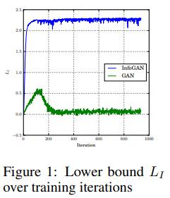

### Title: InfoGAN: Interpretable Representation Learning by Information Maximizing Generative Adversarial Nets https://arxiv.org/pdf/1606.03657.pdf

### Publication: NIPS

### Author：Xi Chen et al.

### Paper Review
- Research Background

  Even though generative models can generate data with good quality, there still exist many problems.

- Problem to Solve

  Help GAN to learn interpretable and meaningful representations.

- Key Design and Algorithm Proposed

  1. They use mutual information to help training GAN.
  2. They use Variational Infomation Maximization to maximize the mutual information.

- Major Contribution

  Their method doesn't need supervision and can learn interpretable and disentangled representations during training. Thus, their method can generate very meaningful images.

- Major limitation

  They don't use an effective way to evaluate the generated images.

- Something you don’t understand

  I don't understand what is mutual information and how it is used in GAN.

- Your view on the research domain/topic/approach/data/solution  (positive or negative)

  1. I think helping GAN to learn and to generate high quality data is promising.
  2. I think using methods like mutual information is a novel way to help GAN to learn.
  3. They use MNIST and CelebA as training data. I think MNIST is a common dataset while CelebA is a novel and relatively challenging dataset.
