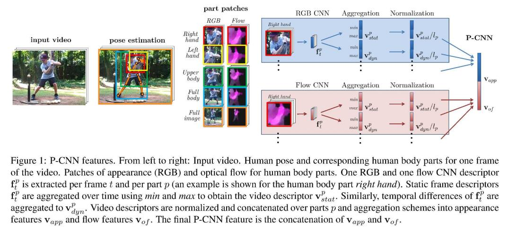

### Title: P-CNN: Pose-based CNN Features for Action Recognition https://www.cv-foundation.org/openaccess/content_iccv_2015/papers/Cheron_P-CNN_Pose-Based_CNN_ICCV_2015_paper.pdf

### Publication: ICCV

### Author：Guilhem Cheron et al.

  

### Paper Review
- Research Background

  Even though action recognition made great progress in the past few years, huge changes in motion and appearance are still challenges to better performance of action recognition.

- Problem to Solve

  Derive representation from human pose to improve performance of action recognition.

- Key Design and Algorithm Proposed

  1. Propose a Pose-based CNN.
  2. Positions of body joints are used to build important regions in images.
  3. Use two CNNs to improve performance, one trained on images, the other trained on videos.

- Major Contribution

  1. Their novel method can achieve a relatively better performance than previous state-of-the-art methods.
  2. Their result proves that estimation of human poses can drastically affect the performance of action recognition.  

- Major limitation

  1. It is not mentioned that whether their method can recognize actions of multiple people in a video clip.
  2. The accuracy is still not high enough.

- Something you don’t understand

  Even though using two CNNs is a very novel method, I still can't understand why using a CNN trained on images.

- Your view on the research domain/topic/approach/data/solution  (positive or negative)

  1. I think improving performance on action recognition in video is promising because even though image recognition is very developed today, action recognition is still under developing.
  2. I think their approach, paying attention to human poses instead of statistics, is very novel.
  3. I think the resolution of their data is a bit low. 
