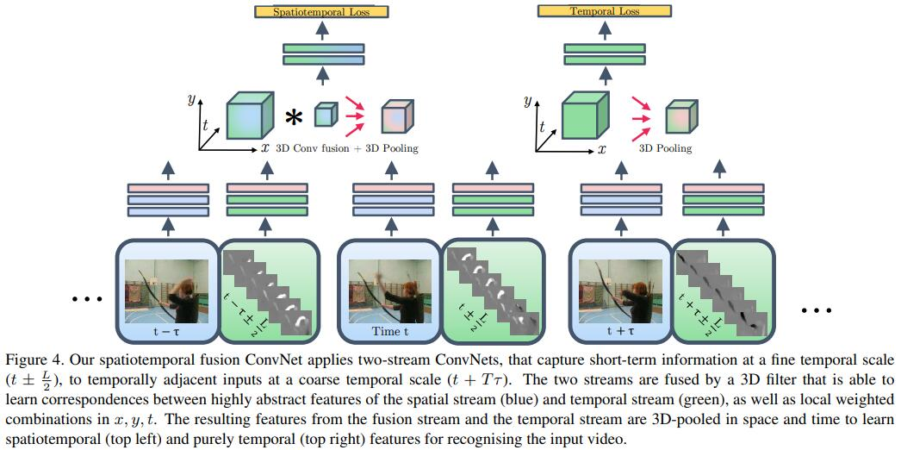

### Title: Convolutional Two-Stream Network Fusion for Video Action Recognition https://www.cv-foundation.org/openaccess/content_cvpr_2016/papers/Feichtenhofer_Convolutional_Two-Stream_Network_CVPR_2016_paper.pdf

### Publication: CVPR

### Author：Christoph Feichtenhofer et al.

  

### Paper Review
- Research Background

  Even though there are many methods to recognize actions in videos proposed in recent years, their performance is far worse than the human performance on action recognition in videos.

- Problem to Solve

  Recognize an object when it is moving from one position to another position.

- Key Design and Algorithm Proposed

  1. Fuse two streaming networks both spatially and temporally.
  2. Use many different fusion methods to fuse networks.
  3. Increase the number of layers of networks.

- Major Contribution

  1. Performance of their method is better than previous methods and the number of parameters is not increased a lot comparing to previous methods.
  2. Study when and how to fuse networks.

- Major limitation

  They don't mention whether it will be hard to track an object if there are many similar objects in the video clip.

- Something you don’t understand

  I don't know why different fusion methods can result in different sizes of output given same input.

- Your view on the research domain/topic/approach/data/solution  (positive or negative)

  1. I think action recognition in video is very promising because current methods cannot achieve results in other domains like image classification.
  2. Using two convolutional networks and fuse them together is a very novel approach.
  3. I think the data they use is very classic video dataset.
