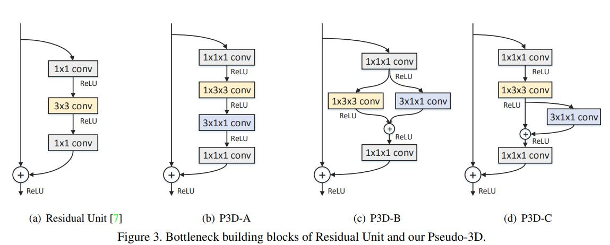

### Title: Learning Spatio-Temporal Representation with Pseudo-3D Residual Networks http://openaccess.thecvf.com/content_ICCV_2017/papers/Qiu_Learning_Spatio-Temporal_Representation_ICCV_2017_paper.pdf

### Publication: ICCV

### Author：Zhaofan Qiu et al.

  

### Paper Review
- Research Background

  CNNs are discovered recently to have the ability to learn both spatial and temporal representations, especially using 3D convolutional kernels. But training a CNN with 3D convolutional kernels is computationally expensive.

- Problem to Solve

  Decrease the computational cost of training a CNN with 3D convolutional kernels while keep the performance of the CNN.

- Key Design and Algorithm Proposed

  1. Propose 3 different kinds of Pseudo-3D blocks used in convolutional kernels.
  2. Decouple 3D convolutional kernel into a 2D like convolutional kernel and a 1D like convolutional kernel.
  3. Test 3 kinds of Pseudo-3D blocks both independently and in a mixed way.

- Major Contribution

  1. Combining Pseudo-3D blocks with ResNet, a kind of CNNs that has good performance.
  2. Achieve better result than the results of some state-of-the-art methods.

- Major limitation

  The resolution of videos in the datasets they use is a bit low.

- Something you don’t understand

  I don't know why different Pseudo-3D blocks can result in different performance, even though the architectures of these blocks are quite similar.

- Your view on the research domain/topic/approach/data/solution  (positive or negative)

  1. I think exploiting the ability of learning representations in video using CNNs is promising.
  2. I think the datasets they use have low resolution, and I think videos with high resolution like 1080p or 2K can be used as datasets. 
