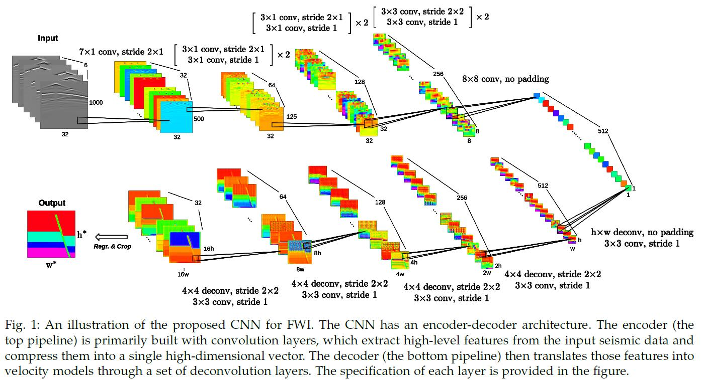

### Title: InversionNet: An Efficient and Accurate Data-driven Full Waveform Inversion https://ieeexplore.ieee.org/document/8918045

### Publication: IEEE Transactions on Computational Imaging

### Author：Yue Wu and Youzuo Lin

  

### Paper Review
- Research Background

  With the computational power increasing and neural networks being revitalized, more and more researches are using data driven method to solve inverse problems.

- Problem to Solve

  Existing methods of solving full-waveform inversion problems are not only computationally expensive but also yielding bad results.

- Key Design and Algorithm Proposed

  1. Propose a CNN with two parts, encoder and decoder.
  2. Encoder consists of convolutional layers, and decoder consists of both convolutional layers and deconvolutional layers.
  3. Use Conditional Random Fields to refine the results from CNN.

- Major Contribution

  1. Their method can produce results with high accuracy.
  2. Their method can produce high quality without using regularization which is used before in this domain.
  3. Their model can not only memorize dataset but also learn physics knowledges.

- Major limitation

  All their data are simulated instead of from real world.

- Something you don’t understand

  I don't understand why there is a learning rate for training CNN and another learning rate for Conditional Random Fields.

- Your view on the research domain/topic/approach/data/solution  (positive or negative)

  1. I think using neural network methods to solve physics problems is promising because traditional methods to solve these problems are computationally expensive.
  2. I think using both encoder and decoder in one CNN is a novel method.
  3. Their data are simulated data instead of from real world, which I think is not so convincing. 
