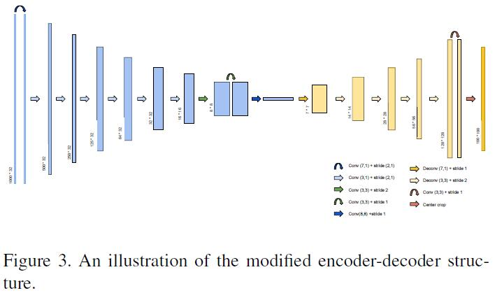

### Title: VelocityGAN: Subsurface Velocity Image Estimation Using Conditional Adversarial Networks https://ieeexplore.ieee.org/document/8658391

### Publication: IEEE Winter Conference on Applications of Computer Vision

### Author：Zhongping Zhang et al.

  

### Paper Review
- Research Background

  Waveform inversion problem is ill-posed non-linear problem with many traditional physics-driven methods to solve. 

- Problem to Solve

  Traditional physics-driven methods for solving waveform inversion problems are computationally expensive, and they cannot overcome local minima and cycle skipping issues.

- Key Design and Algorithm Proposed

  1. Use a GAN as the backbone.
  2. Wasserstein loss is applied to distinguish real data and fake data.

- Major Contribution

  1. They design a GAN to solve the waveform inversion problem.
  2. Their method prevents local minima and expensive computation problems.
  3. Results produced by their method are better than previous methods.

- Major limitation

  They don't mention why they set such parameters for their network.

- Something you don’t understand

  I don't understand why only need to train inverse function.

- Your view on the research domain/topic/approach/data/solution  (positive or negative)

  1. I think using deep learning methods to solve physical problems are very promising.
  2. Since it is hard to obtain large amount of seismic data from real world, it is reasonable to generate data using simulation methods.
