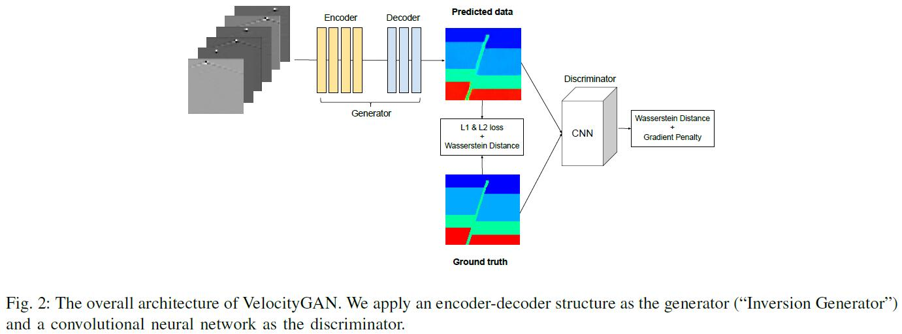

### Title: Data-driven Seismic Waveform Inversion: A Study on the Robustness and Generalization https://arxiv.org/pdf/1809.10262.pdf

### Publication: IEEE TRANSACTIONS ON GEOSCIENCE AND REMOTE SENSING

### Author：Zhongping Zhang and Youzuo Lin

  

### Paper Review
- Research Background

  Full waveform inversion problem is very important in geology, but it's an ill-posed problem without specific solution. And researchers developed physics-driven and data-driven methods to solve this problem.

- Problem to Solve

  Data-driven methods on this problem can be hard to generalize and not robust.

- Key Design and Algorithm Proposed

  1. The backbone of their model is GAN.
  2. They incorporate gradient penalty from Wasserstein GAN and regularization term to help training.

- Major Contribution

  1. They develop the VelocityGAN to solve full waveform inversion problem.
  2. Their method performs better than physics-driven method especially in reduce computational cost.
  3. Their method can generalize on datasets that are not training data.

- Major limitation

  They don't mention why they choose that architecture and hyperparameters in that model.

- Something you don’t understand

  I don't know why they claim their method can outperform physics-driven methods, since in table 3, their methods perform worse than physics-driven methods.

- Your view on the research domain/topic/approach/data/solution  (positive or negative)

  1. I think using deep learning methods to solve geology problems is promising.
  2. I think incorporating new techniques to neural networks is novel.
  3. Their datasets are simulated because it is hard to get large amount of data from real world for this problem. 
