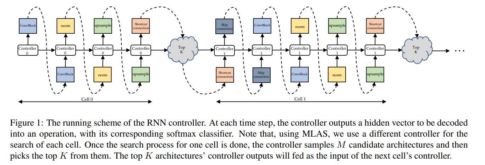

### Title: AutoGAN: Neural Architecture Search for Generative Adversarial Networks https://arxiv.org/pdf/1908.03835.pdf

### Publication: ICCV

### Author：Xinyu Gong et al.

  

### Paper Review
- Research Background

  Both NAS and GAN have been prevailing recently, but there is not attempt to combine NAS and GAN.

- Problem to Solve

  Architecture design of GAN is relying on empirical knowledge without automation, and training procedure of GAN is highly sensitive to hyperparameters.

- Key Design and Algorithm Proposed

  1. Only use NAS to search generator's architecture.
  2. Use RNN controller to control search procedure.

- Major Contribution

  1. It is the first attempt to combine NAS and generative model together.
  2. This automatic architecture search method performs better than handcrafted GAN.

- Major limitation

  Their search space is quite limited, and the resolution of the images is not high.

- Something you don’t understand

  I don't understand what is multi-level architecture search as they don't tell the details of this method.

- Your view on the research domain/topic/approach/data/solution  (positive or negative)

  1. I think applying NAS to generative model is very promising as there are very few attempts to automate designing architecture of GAN.
  2. I think using RNN controller to control the search procedure is very novel. 
  3. The datasets they use in this paper are very common image datasets.
