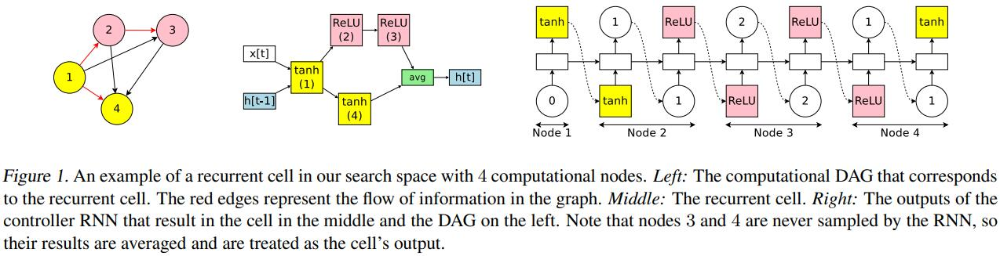

### Title: Efficient Neural Architecture Search via Parameter Sharing https://arxiv.org/pdf/1802.03268.pdf

### Publication: arXiv

### Author：Hieu Pham et al.

  

### Paper Review
- Research Background

  Neural architecture search is successful in designing model architectures for many tasks like image classification.

- Problem to Solve

  Even though neural architecture search can produce novel architectures and good results, it is very computationally expensive and time consuming.

- Key Design and Algorithm Proposed

  1. Use a directed acyclic graph to represent search space.
  2. Use RNN as controller to decide edges to activate and computations to perform.
  3. Child models can share parameters.

- Major Contribution

  1. Their method not only reduces number of parameters, but also significantly saves time.
  2. The performance of their method is better than other methods.

- Major limitation

  They only test their method on language model and image classification model, while they don't test whether models generated by their method can generalize to other datasets.

- Something you don’t understand

  I don't know how the controller choose which previous node to sample.

- Your view on the research domain/topic/approach/data/solution  (positive or negative)

  1. I think reducing time and space complexity of neural architecture search is very promising because previous methods are so time consuming and computationally expensive.
  2. Their datasets are very common datasets. 
