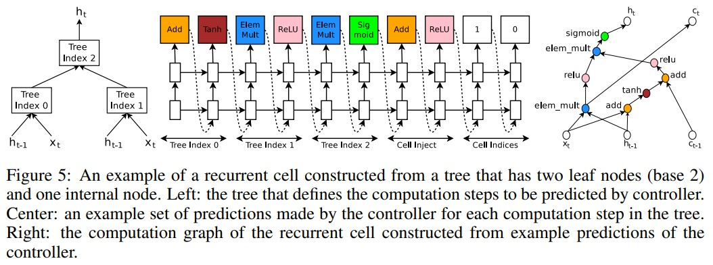

### Title: NEURAL ARCHITECTURE SEARCH WITH REINFORCEMENT LEARNING https://arxiv.org/pdf/1611.01578.pdf

### Publication: ICLR

### Author：Barret Zoph et al.

  

### Paper Review
- Research Background

  Even though there are a lot of works focusing on building neural networks, there is no work trying to automate this procedure.

- Problem to Solve

  Although there have been a lot of works contributing to build state-of-the-art neural networks and it becomes more and more easy for researchers and developers to build neural networks, it still requires a huge amount of expert knowledge and time to design a good neural network.

- Key Design and Algorithm Proposed

  1. Consider network structure as a variable length string which describes the structure.
  2. Use a recurrent network as controller to generate description of architectures.
  3. Use reinforcement learning to maximize the accuracy.

- Major Contribution

  1. They proposed a method to search for neural network structures.
  2. The result of their method outperforms results of state-of-the-art manually designed structures.

- Major limitation

  They don't test their method on other neural networks like generative model.

- Something you don’t understand

  I don't know how they represent neural networks structures in strings.

- Your view on the research domain/topic/approach/data/solution  (positive or negative)

  1. I think automating the procedure of building neural networks is very promising.
  2. I think using strings to represent network structures is very novel.
  3. The data they use is very common image and text dataset. 
