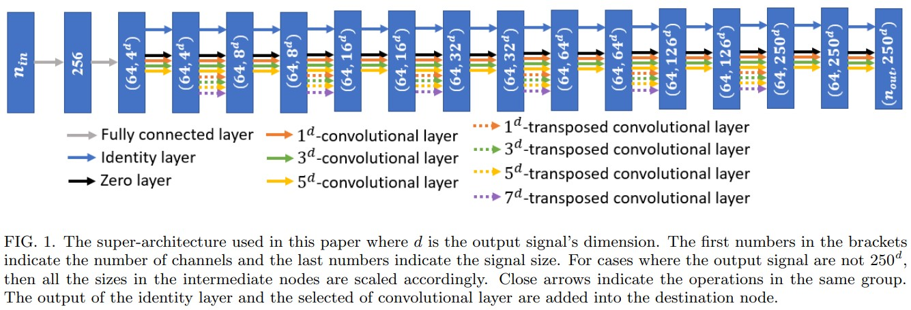

### Title: Up to two billion times acceleration of scientific simulations with deep neural architecture search https://arxiv.org/pdf/2001.08055.pdf

### Publication: arXiv

### Author：M. F. Kasim et al.

  

### Paper Review
- Research Background

  Scientific simulations are important for developing science, but they are computationally expensive. Machine learning is a good method to speed up scientific simulations.

- Problem to Solve

  Even though it is important to make scientific simulations faster using machine learning, it is more important to let machine learning models to be accurate even when the amount of training data is very few.

- Key Design and Algorithm Proposed

  1. Build a super-architecture which roughly sets the number of layers and the output of each layer.
  2. Set search space with respect to each layer and limit operations of each layer.
  3. Choose which operation to perform at each layer first, and then evaluate performance using validation data.

- Major Contribution

  1. They propose a neural architecture search method, DENSE, to accelerate scientific simulation.
  2. Their method can achieve reasonable accuracy.

- Major limitation

  Some simulation results are good, while to me most results are not good enough. 

- Something you don’t understand

  I don't understand why they choose such hyperparameters for their super-architecture, and loss function.

- Your view on the research domain/topic/approach/data/solution  (positive or negative)

  1. Using neural architecture search to choose machine learning methods to accelerate scientific simulations is very promising.
  2. The data they use is scientific simulation data which are generated using simulation methods.
